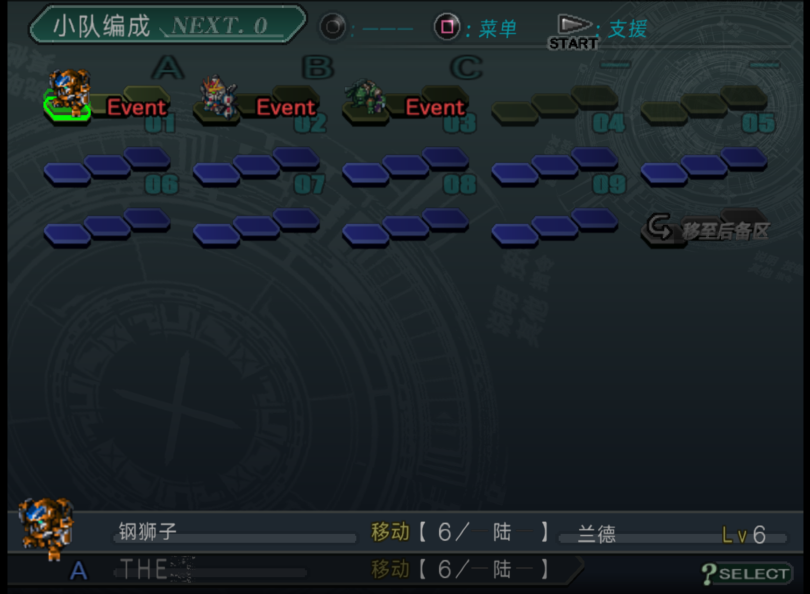
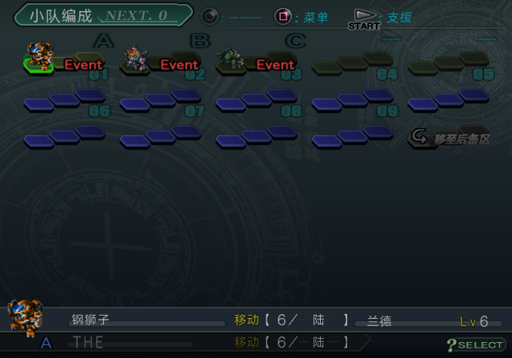
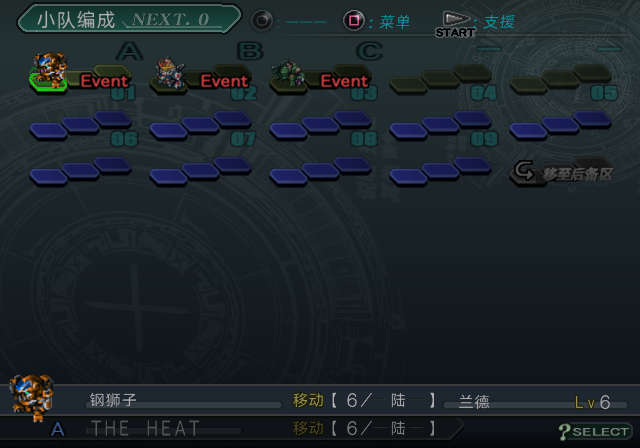
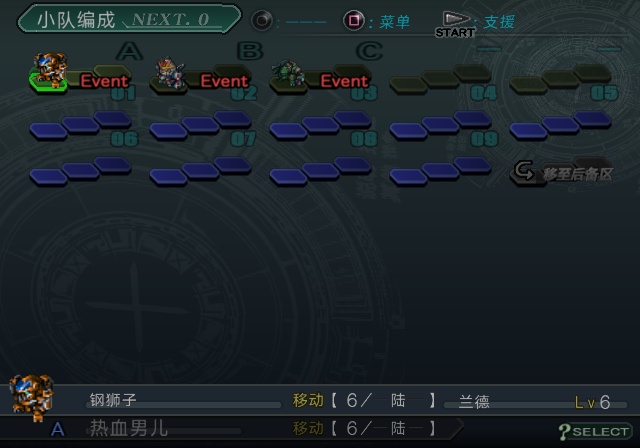
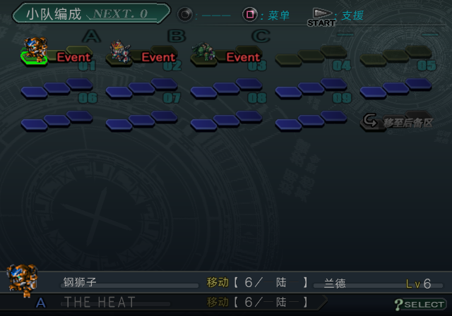
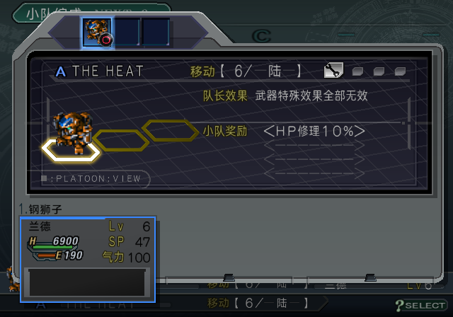
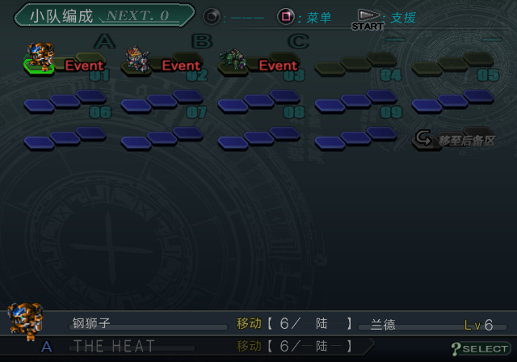

# BEST 兰德 THE HEAT 编队名：2026-10-06

GitHub：[#31：小队名 THE HEAT 乱码及 BEST 固定槽截断（黑泽小皮反馈）](https://github.com/dyzz/srwz-zh/issues/31)，2026-10-07 补录后以 `completed` 关闭。

用户明确最新截图来自 BEST，并指定用 ArmsX2 当前记忆卡读取、小队编成左下角复现。
截图只作证据，未作为写入输入。本文将本篇生产写入修复、旧存档修复副本和运行验证分别记账。

**当前结论（2026-10-07）：用户批准组合字形后，Original / BEST 已正式恢复英文 THE HEAT，
新 ISO、修复卡冷启动、能力页及游戏内保存后重读均通过。下文中文名及 RAM 探针记录是历史阶段，
最终制品和验收见本文末尾“组合字形正式采用”。**

## 已定位的遗漏

今天 `3f9f6e8` 修改的是 SP 的 NISV / STAGE 名称写入器。本篇 NISV 名称写入器
`tools/srwz/ui_name_tables.py` 已使用 `81 40` 空格，但本篇 STAGE 默认编队写入器
`_apply_stage_default_formation_names` 仍直接编码 `THE HEAT`，被共享覆盖表编码成单字节 `20`。
通用文本解码器可以正确读出这个单字节空格，因此原来的解码文本比较也接受错误字节。

锁定编队清单中原先含可见空格的字段共 104 个：THE HEAT 11 个、The Big 92 个、Gran Σ 1 个。
第一次构建在第 13 块 `0x90E8` 拒绝写入：THE HEAT 的 11 个字段中有 10 个是
`packed8-16`，只有 16 字节，完整双字节名称加 NUL 需要 17 字节。该失败未发布新 ISO。

用户随后提出“如果写入不了是不是可以改成热血男儿”。本篇名称表
`ui-name/nisv-squad/097` 与 11 个默认编队名统一采用用户选定的“热血男儿”，
四字加 NUL 共 9 字节，能放入所有既定槽；不需要搬移指针或修改相邻字段。
SP 自有 28 字节名称槽继续保留成功写入的 THE HEAT。本次修改只涉及本篇小队名，
剧情台词不是这次译名修改的范围。用户授权和容量理由保存在
`config/editorial/land-squad-name-user-selected-20261006.json`。

在本篇生产存储边界统一将其他名称中的可见空格转为双字节空格，保留英文、大小写、容量、元数据和指针。
独立最终 ISO 回读同时比较正确存储文本，并拒绝名称中的单字节空格。

回归测试 `tests/test_stage_formation_visible_spaces.py` 调用实际生产写入函数，检查
THE HEAT / The Big 完整字节、固定槽边界和非目标字节；再调用独立验证函数，
要求正确结果通过、原来的单字节空格结果失败。另检查本篇两处名称语料一致、
热血男儿 9 字节能放入全部 11 个锁定字段。压缩和清单解析在这个小型测试中隔离，
全量构建和最终 ISO 回读另行验证。

## ArmsX2 当前卡与自然复现

ArmsX2 设置和运行日志均指向 `/Users/nate/Super-Robot-Wars-Z/work/Mcd001.ps2`，
不是模拟器默认 `memcards/` 目录。测试前复制，源卡 SHA-256：
`a126d7ecce0f6af8e77acab9fed36776a3051a7786dc86f26cdb3f903237496a`。
卡中是本篇 `BISLPS-25887` 存档，没有 SP 存档；ArmsX2 日志记录的执行文件是 `SLPS_732.70`。

在修复前 BEST current（`28e7a3d04225e6e01e0580d112a6ec95e4ed0878f093204876aad6f487aed6a1`）
使用这张卡的副本，LRPS2 冷启动 → 读取第 1 格（兰德 Lv6，第 1 话后，4 回合、BS 40、资金 16078）
→ 中场休息 → 小队 → 光标移到第 1 队，自然复现左下方只显示 THE。
没有修改 RAM、关键词、队员或编队来复现该问题。

RAM 的小队字段 `0x57E0B8`、`0x590918` 均为旧字节；当前关卡脚本中的副本
`0x75FFD8`、`0xD235A8` 也保留单字节空格。卡文件解析确认普通第 1 格
`/BISLPS-25887S0/BISLPS-25887S0` 在 `0x1CF8` 保存该字符串，
中断存档 `/BISLPS-25887Q/BISLPS-25887Q` 在 `0x4F98` 也保存旧字节。
因此资源修复不能据此宣称旧卡中的名字自动更新。

## 第 1 格普通存档的隔离修复副本

原卡保持不变。副本路径：
`work/runtime/lrps2/sp-armsx2-land-20261006/BEST-Land-slot1-repaired.ps2`。
仅修改 S0 中已证明的 24 字节小队名字段及原生 16 位校验和：

- 旧：`82 73 82 67 82 64 20 82 67 82 64 82 60 82 73 00`。
- 新：`87 4E 8C 8C 92 6A 93 88 00`（热血男儿）。
- 文件内实际改变 15 个名字字节和 2 个校验字节；其他所有卡文件逐字节一致。
- 原校验和 `58019` 有效；修复后计算值和保存值均为 `26519`。
- 卡副本 SHA-256：`0c3abae0021b69c33cb41ee225aca156bbbe05f87009d68bfad28191dfaec8f4`。
- 中断存档保持原样；使用这份副本时须选择“读取 → 第 1 格”，不能用“继续”验收。

这项是旧存档迁移，不是 ISO 自然重新生成字段；不能把修复卡的截图当作原卡自动恢复的证据。
脚本、独立卡文件比较和修复回执保存在 `work/analysis/best-land-heat-20261006/repair_slot1.py`
与 `work/runtime/lrps2/sp-armsx2-land-20261006/slot1-repair.json`。

## 本轮验收进度

第一版 750 项单元测试通过，但真实构建拒绝 17 字节名称超出 16 字节槽，未发布。
在用户选定中文名后，两个针对性的回归测试及完整套件 751 项测试通过。
另一个隔离卡将 S0 名字改为完整双字节 THE HEAT，在旧 BEST 的同位置冷启动显示完整英文，
用于证明保存字段与渲染容量不是问题；这不是最终中文方案或 ISO 自动更新旧卡的证据。

中文修复卡在旧 BEST 亦已冷启动读档通过：同一兰德 Lv6 编队的左下角完整显示“热血男儿”，
RAM 的两个实际小队字段均为上述 9 字节字符串加零填充。测试没有 RAM poke；
这一步只验证存档迁移，最终新 ISO 的验收仍单独记录。

Original / BEST 已重建，两个最终 ISO 的全量静态回读和构建批次绑定验证通过：

- Original：`build/iso/zh-release-original/current-original.iso`，SHA-256
  `58a9b0b92ed14c97a5cf2f73d2d055c55d35792997672fedefc03a2a7f3bfcc5`。
- BEST：`build/iso/zh-release-best/current-best.iso`，SHA-256
  `63decf029564de61bf86110f057ae6b34973a8f8bea76ebf90647d39691773c8`。
- 最终 BEST + 中文修复卡冷启动 → 读取第 1 格 → 小队编成，第 1 队左下方完整显示“热血男儿”。
  RAM `0x57E0B8`、`0x590918` 均与修复卡字段逐字节一致。
- RAM `0x75FFD8` 当前关卡资源中的新名称为 `97 EC 8C 8C 92 6A 93 88 00`。
  这里“热”使用生产字库的安全别名 `97 EC`，保存字段使用主码 `87 4E`，两者都映射“热”。
  不应将不同的有效字库码误报为名称不同步。
- ArmsX2 可选卡副本已放入当前记忆卡目录：
  `/Users/nate/Super-Robot-Wars-Z/work/Mcd001-Land-Heat-Man-fixed.ps2`。
  原始 `Mcd001.ps2` 哈希保持不变。选择此副本后使用“读取 → 第 1 格”；中断存档未迁移。

本轮自动运行使用 LRPS2 软件渲染，没有 RAM poke。ArmsX2 原截图是玩家证据；
最终新 ISO 尚不记为 ArmsX2 或 PCSX2 的独立人工验收。

## 本篇 / BEST 同类空格遗漏审计

审计直接读取上述两个最终 ISO，每版核对 110,618 条语义记录引用：显示名 3,147、
执行文件菜单目标 1,166、COMPDATA 菜单目标 1,480、NISV 小队名 104、地图名 73、
默认编队名 11,583、剧情机师名 8,727、条件 670、对白 83,668。
这些是解析器记录引用数，不是去重后的物理字符串数量。
BEST 使用其原生执行文件和版本布局；连携攻击说明的官方修订使用已审定的独立槽映射。

两版这些显示面可见单字节 `20` 均为 **0**。已修复的同类名称遗漏是
The Big 92 处、Gran Σ 1 处；兰德另 11 处改用用户选定的中文名。
只按解码文本查找普通空格会额外标出每版 352 条（350 对白、2 条条件），但逐字节复核
它们全部是安全的双字节空白字形 `98 64`。字库将该槽解码成 U+0020，因此不能把
解码后的普通空格直接视为存储中的单字节 `20`。剧情语料与写入器未作此类误修。
中间进度曾将这 352 条误判为遗漏，在核对字节后已撤回；此处是最终结论。

字节扫描按解码单元确认空格，排除原生控制序列内部的空格与参数。
脚本内含原始 `20`、正确 `81 40`、安全别名 `98 64` 三种输入的独立断言，避免再次混淆。
最终 ISO 原有全量回读还覆盖世界历史、关键词、Q&A、武器效果说明、HSFC、SRVC 等显示面，
对应空格/可见 ASCII 检查均通过。逐条运行截图未覆盖全部显示面，这个覆盖结论属于静态回读。

可复核证据：

- `docs/issue-assets/best-land-heat-20261006/space-audit-final.json`：两版逐项候选分类与 ISO 哈希。
- `docs/issue-assets/best-land-heat-20261006/space-audit-summary.json`：覆盖统计及现有全量回读的零计数。
- `docs/issue-assets/best-land-heat-20261006/audit_spaces.py`：只读审计脚本。
- `docs/issue-assets/best-land-heat-20261006/edition-batch-verification.json`：实际 ISO 与构建回执绑定验证。
- `docs/issue-assets/best-land-heat-20261006/receipt.json`：修复卡和最终 BEST 运行验证。

## 2026-10-07：组合字形可行性试验

用户提出“还有超出的吧，如果就这一处是不是可以考虑造几个特殊字符拼起来”。
复查锁定的 328 个默认小队名、11,583 个字段，当前中文方案没有超容量字段；
仅把兰德恢复为 THE HEAT 后，超容量的是一个名字的十个 16 字节字段，需 17 字节。
另一个同名字段容量 24 字节，可以正常放下。对原生结构扫描发现的已审定名称 10,291 个字段
也做独立容量复核，没有额外发现超容量名称；这不是整个游戏所有文本的像素宽度审计。

只需新增一个组合字形，而非把整个单词压进一个字格：
`[T][H][E＋空白][H][E][A][T]`，七个双字节码加 NUL 共 15 字节。
当前分配表还有 13 个候选槽；隔离试验暂借候选 `97F0`（字形 4400），
未修改正式分配表，也未将该码登记为已分配。组合字形以原生 E 的像素为基础，
保持基线并调整横向比例，留出词间空白。

在最终 BEST 的同一记忆卡副本、同一兰德编队界面，通过临时 RAM 修改一个字形及两个
24 字节名字副本，完整显示 THE HEAT。读回确认名字共 15 字节、组合字形恰好 288 字节。
对第 13 块原生 `0x90E8` 的实际 16 字节槽做离线写入模拟，块长度及所有非目标字节保持相同。

这证明容量和该界面显示可行，仍是 **LRPS2 RAM 探针**，不是正式 ISO 或存档迁移验收。
当前 Original / BEST 制品仍采用已交付的“热血男儿”，SP 的英文资源未改动。
正式采用时应把组合字形作为小队名存储层的明确例外：保留语料 THE HEAT，登记字库分配，
在编解码、NISV 和 STAGE 写入、最终回读中维护同一映射，并补做其他名称显示面和保存重读验证。
不应将私用码写成玩家看到的文本，也不应让通用英文替换规则影响正常对白。

容量结果和运行回执：
`issue-assets/best-land-heat-20261006/formation-capacity-20261007.json`、
`issue-assets/best-land-heat-20261006/ligature-probe-20261007.json`。

## 2026-10-07：组合字形正式采用

用户回复“好，就这样做”，批准将已确认的组合字形纳入生产流程。
语料中的兰德小队名保持 `THE HEAT`，在 Original / BEST 小队名写入层，
仅原文 `ザ・ヒート` 与该译文的组合使用 `[T][H][E＋空白][H][E][A][T]`。
新增分配为私用字符 U+E000、码 `97F0`、字形 4400，登记后剩余候选槽 12 个。
SP 和普通对白未应用这项存储转换，原生英文字母字形保持不变。

组合字形从原生 E 推导，保持竖向基线，将 15 列字面按整数面积采样成 10 列，
在一个 24×24 字格内保留词间空白。最终 ISO 的 288 字节位图与试验 v2 逐字节一致。
完整名字编码为 `82 73 82 67 97 F0 82 67 82 64 82 60 82 73 00`，含 NUL 共 15 字节。
独立最终回读确认两版各 11 个 STAGE 名称字段（10 个容量 16、1 个容量 24）与
NISV 第 97 个名称槽全部正确，槽内剩余填充为零；11,583 个默认名称字段无超容量。

最终制品：

- Original：`build/iso/zh-release-original/current-original.iso`，SHA-256
  `d97684c3d110ca28f422c13d58774aec7b805d009a8d2ccff1f135b57f885d4e`。
- BEST：`build/iso/zh-release-best/current-best.iso`，SHA-256
  `ec7a044915cf21c07c1f41fdc85a5cdf46f81003dd3d1724cbf95bc95c254213`。
- 构建批次：`work/editions/f54c7805c552dfc91224354a85c1fed5bd1b765cdad3694ddb4e542eaf958479/original-best.json`；
  两版全量回读及批次与实际 ISO 绑定验证通过。
- 完整测试：`python3 -m unittest discover -s tests`，754 项通过（142.719 秒）。
  首次测试的两项分配表漂移错误源于根目录旧生成提案；刷新字库提案和验证产物后重跑全部通过。
- 对新的最终 ISO 重做空格审计，每版 110,618 条语义记录引用，可见单字节 `20` 均为零。
  每版 352 条解码普通空格候选仍全部是安全双字节 `98 64`。

这些 ISO 从当时工作区的冻结输入快照构建，包含其他尚未提交的本地工作。
本次提交只包含小队名修复、必要字库校验依赖和本项证据，不包含那些无关改动；
运行验收绑定上列实际 ISO 哈希，不能据此声称仅检出本次提交即可复现整盘完全相同的字节。

原 ArmsX2 卡已有损坏的单字节空格字段，更新 ISO 不会自动改写旧存档。
已制作专用副本 `/Users/nate/Super-Robot-Wars-Z/work/Mcd001-THE-HEAT-ligature-fixed.ps2`，
SHA-256 `396fd930400ce621f8c41c0d0cc41de895636e950aa588cdbfe71964ee94935d`。
只修改 S0 第 1 格存档的 24 字节小队名槽与校验和，其余卡文件逐字节一致；
原 `Mcd001.ps2` 哈希仍为 `a126d7ecce0f6af8e77acab9fed36776a3051a7786dc86f26cdb3f903237496a`。
使用新 ISO 和这份副本时，选择 **“读取 → 第 1 格”**；中断存档没有迁移。

运行证据来自 LRPS2 软件渲染、关闭金手指、每轮从独立进程启动、标题读取第 1 格，
全部命令记录均无 RAM poke 或即时存档恢复：

1. 最终 BEST + 修复卡：编队左下方、小队菜单、能力页均完整显示 THE HEAT。
   RAM `0x57E0B8`、`0x590918` 的实际名字及 `0x75FFD8` 的关卡资源均为 15 字节编码；
   RAM `0x9AEE10` 的整份字体与最终 ISO 解压字库逐字节相同。
2. 通过游戏内“数据管理 → 保存 → 第 1 格”保存至驱动独立卡副本，然后退出进程。
   保存后 S0 字段仍为组合字形编码，存档校验和重新计算为 4357，正确。
3. 以刚保存的卡再次冷启动 BEST，编队栏显示及三个 RAM 位置仍正确。
4. 最终 Original + 修复卡独立冷启动，同位置完整显示英文；三个 RAM 位置为
   `0x57D8B8`、`0x590118`、`0x75F7D8`，整份字库在 `0x9AE610`，与最终 ISO 相同。

这次已经是正式 ISO 的读档及保存重读验证，独立 ArmsX2 / PCSX2 人工验收仍未记为完成。
当前第 1 话的 Event 编队锁定小队命名选项，未把点击该选项记成自动重新命名验证；
11 个 STAGE 默认名和 NISV 表的正确写入由独立最终字节回读确认。

可复核证据：`ligature-production-receipt.json`、`ligature-production-static.json`、
`ligature-slot1-repair.json`、`ligature-native-save.json`、`ligature-edition-batch-verification.json`、
`space-audit-ligature-final.json` 及只读脚本 `verify_ligature_production.py`，
均位于 `docs/issue-assets/best-land-heat-20261006/`。
正式授权与分配依据见 `config/editorial/land-squad-ligature-user-approved-20261007.json`。
