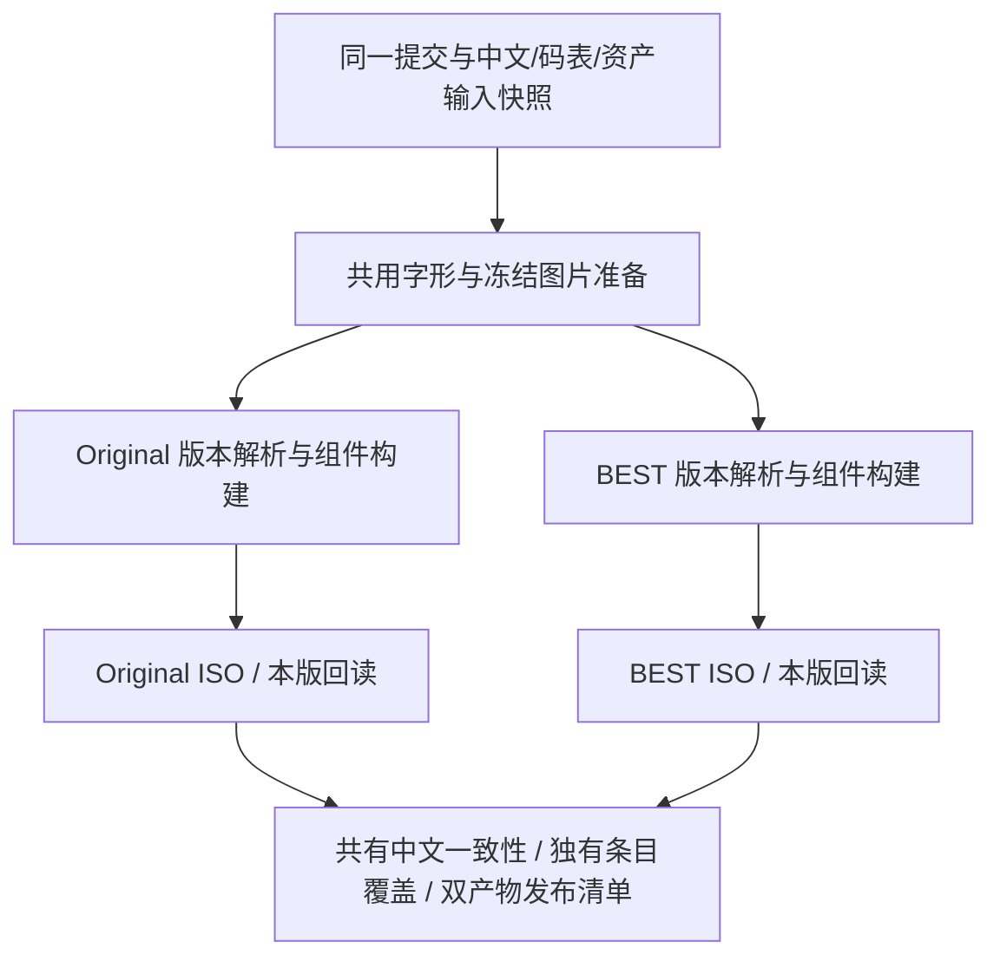

# 下一版本 Original / The Best 双版本构建方案

2026-09-05。目标由“未来考虑切换 BEST 底盘”调整为：**下一汉化版本从同一份中文输入，分别构建 Original 与 The Best 两个产物，长期共用一套翻译与构建实现。** Original 继续支持；BEST 成为正式构建目标。

本文保留最初六步方案及其拆分理由。**现已接入当前 BEST 后端和同批双 ISO 构建，实际实现采用“共用中文编译前端 + 版本后端”。** 阶段 2–5 所需的本版写回能力集中在 `best_build.py` 与 `source-layout.json`，并未按下列拟议文件逐一独立参数化；阶段 6 的发行补丁打包及完整运行回归仍待完成。当前入口、依赖与验证范围见 [当前 BEST 构建](BEST_CURRENT_BUILD.md)，第一阶段历史记录见 [阶段 1 验证](DUAL_EDITION_PHASE1.md)。alpha1/r1 保留历史身份，不作为当前源码构建的输入。

## 1. 固定产品规则

| 范围 | Original 产物 | BEST 产物 |
| --- | --- | --- |
| 中文语料、术语、玩家姓名变量 | 使用同一份发布输入快照 | 使用同一份发布输入快照 |
| 字码分配、字形与已审核索引图片 | 共用已审核映射和资产；写入位置按本版契约 | 同左；字库的 ELF 补丁和目录写入按 BEST 地址 |
| 四处 COMPDATA 数据订正 | 应用已经提交的四字段回迁 | 校验原生正确值及汉化后保留值，不再次套用 Original 前值补丁 |
| 关键词／人物／机体／剧情流程全开放 | 保留现有策略 | 使用 BEST 地址实施相同策略；保留无效 ID 拒绝和存档标志写入边界 |
| B-Save 等官方程序修改 | 当前仍保留 Original 程序；后续单独决定是否回迁 | 从 BEST 原生 ELF 开始构建，保留其官方修改，并做针对性回归 |
| TWP 动画与其索引／大小表 | 沿用 Original 原盘 | 沿用 BEST 原盘 |
| 音频、视频及版本独有元数据 | 保留本版数据和编号 | 保留本版数据和编号；中文字幕按来源绑定写入 |
| 盘号、原盘身份与固定布局 | `SLPS_258.87`，Original 原盘契约 | `SLPS_732.70`，BEST 原盘契约 |

“战斗动画不用管”落实为两版各自保留原生 TWP 资源，不做两版之间的动画回迁。BEST 自带的动画不会因为制作双版本而换回 Original。字幕和语音编号仍需正确绑定，这是正常播放所需的汉化构建工作。

## 2. 当前代码的实际状态与阻碍

### 原版生产链已经具备可复用的主体

```text
rebuild_zh_font.py
  → prepare_zh_release_font.py / build_zh_font_component.py
  → build_story_component.py / 图像组件 / build_library_v02_component.py
  → build_full_story_components.py
  → compose_full_story_library_components.py
build_iso.py → verify_full_story_iso_content.py
```

Rust 压缩、文本编码、字段写回、索引图片注入、ISO 布局与大部分回读逻辑可继续使用。核心集成构建器现有 12,177 行，最终回读器 7,922 行；不复制成两套版本各自维护。

### BEST 实验脚本需要退出生产依赖

[`tools/build_best_candidate.py`](../tools/build_best_candidate.py) 是 630 行的冻结组件迁移工具。它以 Original 日文、BEST 日文、旧 Original 中文组件做三方迁移，而不是直接消费当前中文语料。

具体阻碍：

- `prepare()` 在首次运行后固定中文组件、语料和工具快照，后续不会接收新的润色。
- `port_stage()` 仍包含“劝界→观界”“机动军→机动群”，并要求从固定“兰德”替换为 `$n`。当前共享语料已完成这些修订；动态姓名已经是 `$n` 的新输入会不满足旧前值断言。
- `port_compdata()` 仍要求旧中文含 `10EN`，再改成 `5EN`，两个 NPC 则硬编码为“奥古兵”。当前生产语料已经是 `5EN` 和“奥古士兵”。
- `parse_candidate_stage()` 为适配 Original 解析器，在临时副本中改写 BEST 的三条识别签名字节。这是实验桥接，正式解析器应直接支持本版签名。
- 当前中文组件还在继续扩字库和润色；不能假定它与 alpha1 冻结快照具有相同的文本池、空闲区或可执行补丁布局。

保留该工具用于历史复现及对照；新正式入口不调用它。已经验证的地址、所有权、字段关系和补丁语义转成有来源锁的版本契约，不在每次 build 时重新用相似度猜地址。

### 必须处理的硬编码

本轮字面检索在 21 个 Python 文件中找到 `SLPS_258.87` 引用；其中包含提示文字和实验文件，不等同于 21 个程序缺陷。完整检索记录见 [代码耦合清单](../work/analysis/dual-edition-build-plan-20260905/code-coupling-inventory.json)。

| 现有位置 | 需要改造的具体责任 |
| --- | --- |
| `build_full_story_components.py` | ELF 成员常量、最终输出字典、COMPDATA 基址检查、各补丁契约与依赖规划 |
| `build_story_component.py`、`srwz/stage.py`、`srwz/writers.py` | 本版原盘、函数表、加载基址、条件表签名、文本指针所有者及本版槽位预算 |
| `prepare_zh_release_font.py`、`build_zh_font_component.py`、`verify_zh_release_font.py`、`srwz/font.py` | 分离共享字形/码表与本版 ELF、扩展字表、跳转补丁、归档目录位置 |
| `build_library_v02_component.py`、`srwz/library.py` | 本版原始成员锁、人物字段来源、VOIC 字段、图鉴目录和全开放契约 |
| `library_unlock.py`、`full_name_order.py`、`game_mode_unlock.py`、各标签/颜色/对齐模块 | 由版本契约提供预期成员及指令位置；继续严格验证前值，不删除成员检查以“兼容 BEST” |
| `rebuild_zh_font.py`、`build_text_update_iso.py` | 当前全局缓存、组件目录、组合 manifest 路径和快路径默认 ISO 配置 |
| `compose_full_story_library_components.py` | 已有 manifest 参数，但集成输出根仍固定；检查输入组件版别及成员写入归属 |
| `verify_full_story_iso_content.py` | `--iso` 之外仍有全局 Original 配置、成员名和来源；必须从同一版本上下文选择所有依据 |
| `build_iso.py`、`srwz/iso_config.py` | 已有 profile 目录隔离基础；扩展双产物/补丁命名、版本身份和发布聚合记录 |
| `build_release.py` | 现有 xdelta 打包器，不能用此名称新建双构建入口。其来源固定绑定 `original-disc.json` 和 Original Redump 信息，文件名与发布目录也只有单版本；需参数化本版来源 manifest 和包名 |

已经核实的参数例子：

| 参数 | Original | BEST |
| --- | --- | --- |
| STAGE 加载基址 | `0x7566F0` | `0x756EF0` |
| STAGE 函数表文件偏移 | `0x2FF0B0` | `0x2FF830` |
| COMPDATA 加载基址 | `0x6D6800` | `0x6D7000` |
| 三条条件表 store 签名字节 | `b05222ac` / `b85222ac` / `c05222ac` | `b05a22ac` / `b85a22ac` / `c05a22ac` |
| 人物图鉴目录文件偏移 | `0x32A810` | `0x32B040` |

函数表偏移相差 `0x780`，人物图鉴目录相差 `0x830`。这两例已经说明不能给所有 ELF 地址统一加 `0x800`。

## 3. 目标代码结构

保留现有组件工具，在其上增加薄的双版本入口，逐步把版本数据从代码中移出。下面是拟议结构，不是已存在的命令或目录：

```text
corpus/zh/                         # 继续是唯一中文编辑入口
config/encoding/                   # 共用码表分配，不复制两份
config/fonts/                      # 共用字体/字形和排版政策
config/assets/                     # 共用已审核图片及冻结索引快照
config/editions/
  original/
    edition.json                   # 原盘身份、布局、原始来源、输出 profile
    executable-patches.json        # 指令前值/写入值、代码区与字段地址
    archive-map.json               # 本版目录、解析参数和空间预算
    source-bindings.json           # 共享语义条目到 Original 来源的绑定
  best/
    edition.json
    executable-patches.json
    archive-map.json
    source-bindings.json
config/release/
  dual-current.json                # 两个目标 + 同一汉化版本/功能政策
tools/
  build_editions.py                # 新总入口：准备共用输入、调度版本、汇总
  verify_editions.py               # 已有输入/ISO/回读记录绑定；跨版语义比较待实施
  build_release.py                 # 保留现有 xdelta 打包器，扩展版别支持
  srwz/
    edition.py                    # EditionProfile + BuildContext 严格加载
    release_inputs.py             # 一次冻结本次中文/码表/资产输入
    source_bindings.py            # 版本来源匹配、覆盖检查与语义 ID 对应
    ...现有编码、解析、写回、补丁和压缩模块...
```

`EditionProfile` 是只读版本事实：原盘锁、ELF 成员、段与地址表、解析签名、原始成员锁。`BuildContext` 是本次构建的输入快照、输出根、缓存命名空间和配置路径。汉化功能政策（全开放等）属于共享发布配置；它的指令实现分别属于版本补丁契约。

现有大配置中的通用组件选项继续共用；只有来源、地址、布局与产物位置分版。不要复制两份完整的 `full-story-components.json`。允许将通用配置与版本契约解析成 `work/` 下的完整配置供现有工具读取；解析过程应拒绝重复字段、未知覆盖项及来源冲突，并记录展开后配置哈希。

旧命令暂时作为 Original 兼容入口，仍有明确默认值。阶段 1 的 `original-production-v1` 适配器先将输入快照复制到独立执行目录，使用子进程调用同一套 Original 工具，内部旧路径相对于该目录解析。它不等于核心构建器已经完成参数化。后续内部函数通过参数接收上下文，不在一次进程中反复改模块全局常量；共享的是输入快照和经过校验的资产，不是可写输出目录。

## 4. 同一份中文如何绑定两个原文版本

采用“稳定语义 ID + 两版来源绑定”。现有条目 ID 可以继续用；它对 BEST 是共享翻译 ID，不要求数字恰好等于 BEST 本地记录编号。

每个绑定至少记录：`translation_id`、`edition`、成员/块/结构字段、原文哈希、必要的角色/上下文哈希、来源资源锁。布局偏移由本版结构解析获得或由严格契约锁定。

- 原文与结构均相同：经本版来源验证后共用原绑定。
- 官方订正了日文：同一中文 ID 绑定两个合法日文来源，不能拿 Original 哈希去验证 BEST，也不能直接跳过原文哈希检查。
- 一个中文句子有多个字幕引用：允许一个翻译 ID 对多个本地记录；每个记录仍保留本版语音索引和元数据。
- BEST 独有记录：已有相同语义时显式映射到共享译文；新语义才新增中文条目，并标明适用版本。对新增 11 条 SRVC 记录重新验证覆盖，不凭字符串相似度自动认定。
- 人物 407/408 声优、驾驶员 796/797 given 的现有定向覆盖需经过版本来源解析；BEST 原生订正来源与 Original 不同，中文结果仍统一。
- 所有已回迁文字，包括 `$n`、Q&A 和能力说明，都直接消费共享语料，删除正式构建中的临时 `replace()` 修订步骤。

发布前比较两版共有语义 ID 的最终解码文本和控制符，而不是比较压缩包字节或强制两版记录数相同。多引用和版本独有条目单独核对覆盖率。

## 5. 构建顺序、目录与缓存



“同时 build”现已支持一条命令产生同批两个版本：先执行一次 Original 共用前端，再执行 BEST 后端；`best,original` 和只选 `best` 同样遵循依赖顺序。两个原盘仍为必需输入。现有每个组件已使用线程与 Rust worker，双任务直接各开满 CPU 会超额并发；后续并行版必须有整个发布批次的统一 worker 上限。

拟议路径：

```text
work/build/shared/<input_digest>/            # 发布输入与共用字形/图片，只读
work/build/zh-release-original/<run_key>/    # project/ 独立执行目录、logs/ 构建日志
work/build/zh-release-best/<run_key>/        # 为 BEST 保留的对应命名空间
work/cache/editions/original/
work/cache/editions/best/
manifests/editions/original/                 # 本版组件、原文覆盖、ISO 回读
manifests/editions/best/
work/editions/<input_digest>/original.json   # 阶段 1 已实现的批次记录
build/iso/zh-release-original/current-original.iso
build/iso/zh-release-best/srwz-zh-best-current.iso
build/iso/<release_tag>/srwz-zh-<release_tag>-original.iso
build/iso/<release_tag>/srwz-zh-<release_tag>-best.iso
build/iso/<release_tag>/release-manifest.json
```

`release_tag` 使用项目现有的 `vMAJOR.MINOR.PATCH` 形式，由实际发版指定，本计划不预设下一版本号。现有 `srwz-zh-current.iso` 在过渡期继续代表 Original；新双版本入口不得让 BEST 写入该路径，也不得悄悄改变旧命令的默认底盘。

缓存至少区分：输入内容哈希、版本/原盘身份、版本契约、共享字码与图片哈希、压缩策略、工具实现。共用完整归档必须证明源字节、目标布局及写入方式兼容；共用字形/像素不等于可以共用带本版地址表的最终 ELF。

发布输入在开始时固定：至少覆盖源提交与实际输入内容哈希。开发中的未提交语料也以内容哈希固定；两版不得在不同时间各自重新扫描可变的 `corpus/zh`。正式发布归属到明确源码提交。若有新润色进入，留给下一批构建。

任一版本失败，聚合命令返回失败，同时保留另一个版本已完成的诊断产物；不得输出“双版本发布通过”。重跑只复用该批次哈希匹配的成功节点。原盘不匹配、输出目录重叠、跨版组件混用应在压缩和 ISO 写入前拒绝。

目前可执行：

```sh
python3 tools/build_editions.py --plan
python3 tools/build_editions.py --editions original --require-legacy-equivalence
python3 tools/verify_editions.py --manifest work/editions/<input_digest>/original.json
```

`--require-legacy-equivalence` 用于改造期间验证 Original 的逐字节保真。新润色预期改变组件时可省略；原盘身份、组件和 ISO 语义回读检查仍然执行。批次验证检查真实 ISO 与输入/语义回读记录的绑定；BEST 后端已逐条核对同批 STAGE 文本及编码字节、SRVC 字幕和图鉴字段，模拟器验收单独记录。

当前双版及单独 BEST 构建已可执行；以下带 `release_tag` 的发行聚合清单仍为后续目标：

```sh
python3 tools/build_editions.py --editions original,best
python3 tools/build_editions.py --editions best
python3 tools/verify_editions.py --manifest build/iso/<release_tag>/release-manifest.json
```

发行补丁继续使用现有 `build_release.py`。先将它的来源验证改为显式本版 manifest，保留必需的完整原盘哈希锁；外部来源信息必须与本版证据一致，不得给 BEST 套用 Original 的 Redump 字段。当前 BEST 分析锁可作为本地输入身份，公开支持的原盘来源需另行明确。

打包器需要解除当前唯一的 `srwz-zh-<tag>.xdelta` / 单一发布目录限制，产出 `srwz-zh-<tag>-original.xdelta` 与 `srwz-zh-<tag>-best.xdelta`，对应说明、校验文件、ZIP 和临时目录均带版别。两份补丁各自还原并检查目标 ISO 哈希；不得用一份补丁同时声称支持两个不同原盘。

## 6. 六步实施安排

| 步骤 | 主要改动与文件 | 完成条件 | 相对工作量 |
| --- | --- | --- | --- |
| 1. 版本上下文与 Original 保真（已完成） | `edition.py`、两版身份契约、`BuildContext`；独立执行目录适配器、输出和缓存；固定本次公共输入 | 新 Original 入口的 23 个替换成员与 ISO 哈希等于当前生产链；版别错误/输出别名被拒绝，详细记录见阶段 1 文档 | 中 |
| 2. BEST ELF 与字体 | `executable-patches.json`、`archive-map.json`；改造字体准备/写入/回读、全开放、姓名、模式、标签等模块 | 当前共用字库可写入 BEST；所有中文补丁前值和跳转目标验证；声明写入范围之外保留 BEST 原生代码；两版全开放策略成立 | 高 |
| 3. 来源绑定与数据/图鉴 | `source_bindings.py`；COMPDATA、人物图鉴、技能说明、Q&A 的来源分版；共用译文输入 | 两版共有条目解码结果一致；四字段 Original 应用/BEST 保留；VOIC 和非文字字段保留本版值；没有未消费或误匹配覆盖项 | 中 |
| 4. BEST STAGE 正式写回 | `stage.py` 直接接受本版条件签名；`build_story_component.py`/`writers.py` 使用 BEST 所有者和预算；锁定 26/111/150/161 等已知特殊块 | 从 BEST 原始块直接构建并回读全部目录及选定文本；`$n`、条件、别名/控制符保留；不得依赖 alpha1 中文块或临时改指令再解析 | 高 |
| 5. 其余版本资源与双 ISO | SRVC、NISV、HSFC、VEFF、LIBRARY 合成与 ISO 配置；`build_editions.py`、`verify_editions.py` | 两版完整组件与 ISO 回读；新增字幕记录覆盖、原生语音元数据正确；各版 TWP/视频保留；各版槽位、LBA、盘号与原盘契约通过 | 中至高 |
| 6. 下一版发布回归 | `build_release.py` 双版补丁打包及还原、来源身份、聚合清单、缓存/并发/复现测试；两版独立运行场景 | 同一输入两次构建哈希稳定；两个版本均完成新游戏、普通存档与关键功能验收；任一失败不标记双版本可发布 | 打包改造与运行验证 |

阶段 2 与 4 是主要工程风险。正式资源消费都迁到本版来源后，再让双版本总入口成为默认发布流程。每一步按功能提交，生成锁和其对应实现一起纳入阶段收尾；禁止靠复制整份大构建器或自动二进制差分绕过尚未完成的接口。

阶段 1 先保留现有模块边界；后续只有在版本契约接入确有需要时才拆出独立子构建器。这样可以对每次改造单独核验 Original 的字节保真，避免把双版本支持与全面重构绑在一次变更里。

## 7. 下一版必须覆盖的验证

**静态及构建：**版本身份/完整字段前值反例、两版输出隔离、不同运行顺序不串缓存；原文绑定覆盖及共有中文一致性；独有字幕/VOIC/VEFF 引用；两版压缩往返、槽位和后续 LBA；全部声明外代码/数据保留；同快照重复构建与补丁还原。

**两版分别运行：**冷启动、两位主角新游戏并进入 STAGE；普通记忆卡读取、保存后重载、由中场进入下一关；自定义姓名代入；图鉴/关键词/流程全开放；模式选择与确认；战斗字幕、声音和变形/分离后的弹数与预览。BEST 官方修改应以 BEST 运行证据验收，不能用 Original 的通过记录替代。

两版共享存档格式只能从正常记忆卡路径逐场景验证。历史 alpha1 的 LRPS2 普通读档证据可作为测试线索，但不能证明本次新 ISO；跨版本即时存档不作为兼容验收。PCSX2 与 LRPS2 证据分开记录，并绑定版别、ISO 哈希和具体场景。

**当前双构建入口与 BEST 后端已接入；底层独立参数化、双版发行补丁打包及完整 PCSX2 回归仍需继续。** 当前能力及运行证据以 [当前 BEST 构建](BEST_CURRENT_BUILD.md) 为准。
