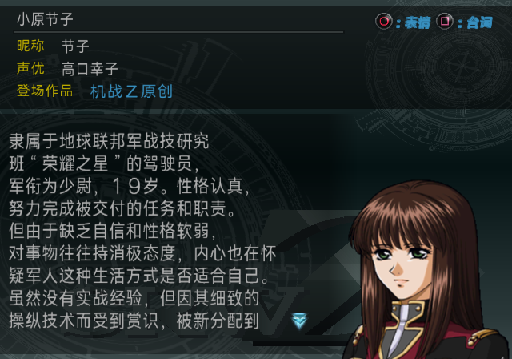
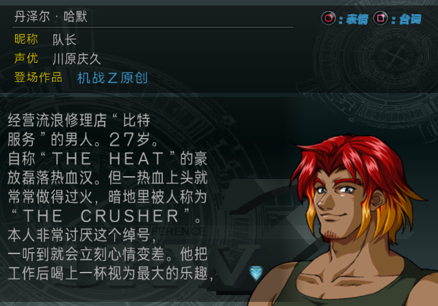

# 图鉴主角姓名修复（2026-09-10）

本轮按用户确认的规则保留玩家改名，修正日文默认姓名和节子的姓名顺序。Original 与 The Best 使用各自已核验的函数位置，修复只影响角色事典详情页的主角全名及昵称显示，不写回存档或运行驾驶员记录。

反馈来源：百度贴吧用户 **zj83519**，由用户在本次对话中补充确认。

玩家报告“v0.3.0 是中文，v0.4.1 变成日文”具有明确的版本差异解释：

| 版本 | 节子图鉴 CHFN | 程序识别主角的全名 | 是否进入动态覆盖 |
| --- | --- | --- | --- |
| v0.2.0 | 节子·大原 | 节子·小原 | 不匹配，不进入 |
| v0.3.0 | 节子·大原 | 节子·小原 | 不匹配，不进入 |
| v0.4.0 | 小原节子 | 小原节子 | 匹配，进入 |
| v0.4.1 | 小原节子 | 小原节子 | 匹配，进入 |

v0.2.0／v0.3.0 的“大原”本身是旧译错误，却意外阻止了主角专用分支。校订后两处名称一致，分支开始读取运行中的姓名记录；如果记录含日文，就会把中文图鉴字段覆盖成日文。这个条件从 v0.4.0 已存在，并非只能发生于 v0.4.1。兰德四版中的图鉴全名和识别名都一致，因此此前就有同样的动态覆盖路径。

以上版本差异直接读取四个 Git 发布标签的图鉴语料和 ELF 文本配置；未把它表述为已拿到反馈者的旧存档复现。反馈截图的准确底盘和日文姓名进入运行记录的来源仍未知。此前静态与 LRPS2 原始证据保留在[排查报告](LIBRARY_PROTAGONIST_NAMES_INVESTIGATION_20260910.md)。

v0.2.0 另以本地保留的发布 xdelta 和已核验 Original 原盘还原成品，完整 SHA-256 为 `24319f1bc509beab4e838bc7078b22d576280b55aece18948901fc7c0fa01bba`，与发布标签的目标哈希一致。直接回读确认：节子 CHFN／CHNN 为“节子·大原／节子”，程序识别名为“节子·小原”；兰德两处均为“兰德·特拉维斯”，CHNN 为“兰德”。图鉴姓名函数与已分析的原版函数逐字节相同。由此可知，v0.2.0 的节子走固定图鉴姓名回退，不会经此分支带入运行记录的日文名，也不会跟随玩家改名；兰德仍使用动态姓名。这是发布成品回读与代码分支判断，本轮未运行 v0.2.0 模拟器画面。还原和回读凭据纳入下方机器可读记录的 `v020_release_readback`。

修复后的规则如下：

- 仍由图鉴 CHFN 识别节子与兰德，并读取对应运行驾驶员记录，保留玩家修改的姓、名和昵称。
- 仅当某字段与该主角的日文默认值逐字节相等、连同结束符完全匹配时，在输出缓冲区使用对应中文默认值。例如 `オハラ`→“小原”、`セツコ`→“节子”。默认名后附加文字的自定义名不会被当成默认值。
- 姓、名、昵称分别判断，允许部分字段改名。节子使用“姓＋名”，兰德使用“名·姓”，不再读取可能残留的旧姓名顺序标志。
- 使用已构建的中文默认姓名与间隔号，不另建一套汉字编码。普通人物不进入该分支；空姓名仍保留原函数的失败返回和调用方回退行为。主角识别沿用原函数按 ELF 默认名长度比较的方式：ZKAN 的 CHFN 字段由长度界定，紧随其后的是 CHNN 标签，不能要求它另带零字节结束符。
- 替换原函数的 560 字节分配范围，不扩展 ELF，不改变成员大小、LBA、图鉴正文或其他资源。两个版本分别校验原函数 SHA-256；未知改动会拒绝写入，重复应用保持幂等。

实现位于 [`library_protagonist_names.py`](../tools/srwz/library_protagonist_names.py)。Original 的完整组件构建器和最终 ISO 回读器已接入；Best 后端按独立的原生函数位置生成代码，并将这段写入计入 ELF 修改范围审计。两版不会共用未经重定位的机器码。

新增测试执行实际生成的 MIPS 指令，包含分支延迟槽，检查默认日文名、默认中文名、自定义名、默认名前缀、部分字段改名、最长字段、空值回退和普通人物。测试同时校验源姓名记录、非易失寄存器、栈指针及输出缓冲区边界。`python3 -m unittest discover -s tests` 共 269 项通过，用时 76.380 秒。

两版候选均从已核验的 v0.4.1 镜像创建独立副本，只替换该函数；逐字节比较确认修改范围之外完全一致。候选 SHA-256：

- Original：`aa0d6f2f56518644dbb22c11050509a0038d308a757fab4116ef3085d6341b9d`
- The Best：`dc8fe15791a0a2bae0e33ee0c1ee0bf7b26895eb387206bcae7f046caf88fbc0`

运行回归采用冷启动、标题菜单进入角色事典，随后使用正常按键切换人物。日文、自定义和混合姓名通过明确标记的 RAM 诊断输入设置；它们验证显示规则和源记录不被回写，不代表反馈者存档的自然复现。完整构建在隔离工作区基于 v0.4.1 发布提交加本次源码变更执行，没有混入主工作区的其他剧情、发布说明或复盘改动。

Original 与 The Best 的完整构建、成员检查及最终 ISO 回读均通过。完整构建的两份 ISO 哈希分别与上述运行候选完全一致；相对 v0.4.1，各自仅在原姓名函数的 560 字节范围内改变 482 字节。

两版均完成 11,200 帧的 LRPS2 回归，并直接核对以下 9 个画面，合计 18 张截图。表中输出为“全名／昵称”；日文、自定义和混合输入均有明确的 RAM 修改记录。

| 输入 | 节子输出 | 兰德输出 |
| --- | --- | --- |
| 中文默认姓名 | 小原节子／节子 | 兰德·特拉维斯／兰德 |
| 日文默认姓名 | 小原节子／节子 | 兰德·特拉维斯／兰德 |
| 完全改名 | 兜甲儿／甲儿 | 丹泽尔·哈默／队长 |
| 部分字段改名，其余为日文默认值 | 小原甲儿／甲儿 | 兰德·哈默／队长 |

普通人物对照为丹泽尔，保持“丹泽尔·哈默／丹泽尔”。两版各 8 次主角画面采样均确认显示函数没有改变输入姓名记录；源记忆卡和隔离副本的运行前后哈希均一致。

修复后的节子（日文默认姓名输入，Original）：

修复后的兰德（自定义姓名输入，The Best）：

全部截图、版本对比、候选身份、源码哈希、完整构建和回读引用、运行记录与测试日志绑定在[机器可读凭据](../manifests/editions/library-protagonist-names-fix-20260910.json)。本次没有执行 PCSX2，未获得反馈者存档，也没有发布新补丁，已冻结的 v0.4.1 发布镜像保持原样。
