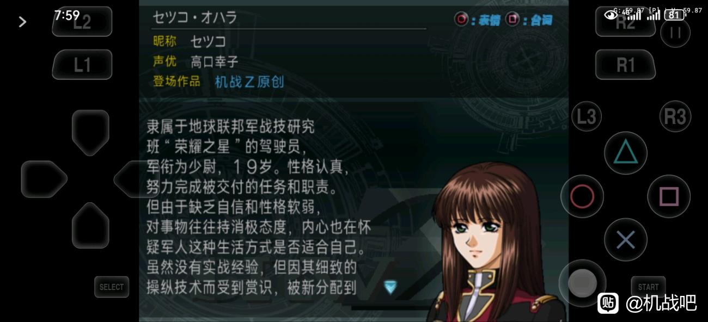
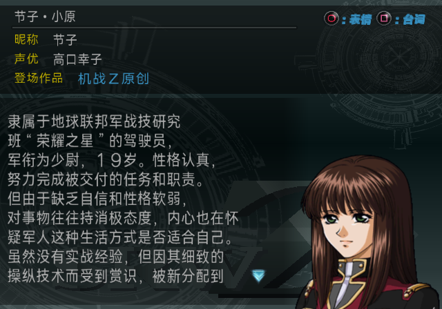
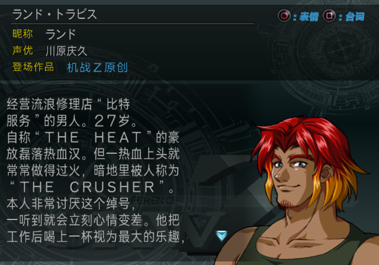

# 图鉴主角姓名排查（2026-09-10）

**Original 与 The Best 都有同一条主角动态姓名覆盖路径；两版 v0.4.1 均已在 LRPS2 复现节子全名顺序错误。兰德的中文默认名正常，但运行记录含日文姓名时也会覆盖中文图鉴字段。仅凭反馈截图不能判定反馈者使用的版本。**

反馈来源：百度贴吧用户 **zj83519**，由用户在本次对话中补充确认。

本文保留修复前的排查和证据：该阶段未修改生产代码、语料或 ISO，未执行 PCSX2。运行验证使用记忆卡的隔离副本，源卡和副本在运行前后哈希均未变化。后续按用户确认的“保留玩家改名，修正默认日文名和姓名顺序”完成了两版修复，并查明 v0.3.0 到 v0.4.1 的回归条件，见[修复与回归报告](LIBRARY_PROTAGONIST_NAMES_FIX_20260910.md)。其他工作区改动未混入本次验证。

反馈截图的标题为 `セツコ・オハラ`，昵称为 `セツコ`，正文和作品名已汉化。截图未提供补丁版本、ISO 哈希、Original／Best 标识或存档来源。因此下面把“当前发布镜像实际行为”和“反馈截图的具体来源”分开记录。

| 检查项目 | Original v0.4.1 | The Best v0.4.1 |
| --- | --- | --- |
| 镜像身份 | `SLPS_258.87`，完整 SHA-256 与发布配置一致 | `SLPS_732.70`，完整 SHA-256 与发布配置一致 |
| 图鉴 `character/397` 的 CHFN／CHNN | 小原节子／节子 | 小原节子／节子 |
| 图鉴 `character/400` 的 CHFN／CHNN | 兰德·特拉维斯／兰德 | 兰德·特拉维斯／兰德 |
| COMPDATA 驾驶员 702 的显示名／姓／名 | 节子／小原／节子 | 节子／小原／节子 |
| COMPDATA 驾驶员 713 的显示名／姓／名 | 兰德／特拉维斯／兰德 | 兰德／特拉维斯／兰德 |
| 未修改镜像的 LRPS2 节子详情页 | **节子·小原／节子** | **节子·小原／节子** |
| 未修改镜像的 LRPS2 兰德详情页 | 兰德·特拉维斯／兰德 | 兰德·特拉维斯／兰德 |

两份发布镜像哈希：

- Original：`7ee310d80d6167a85ab4a4fe4ea373df45817e02b0ebd1838f4506e1fdcea6e6`
- The Best：`d7a92841d3981ef0fb59d67f1f794692103b00730d6936fdec767a216ab6af9c`

已另外核验两份日文原盘的发布源哈希，按各版 ELF 中实际的归档偏移表解码人物图鉴；没有套用 Original 偏移读取 Best。以上四个汉化图鉴字段和 COMPDATA 姓名均正确，两个汉化 ELF 内也未找到这些日文姓名的原始 CP932 字节序列。该结果限定于已检查的镜像和数据面，不代表所有历史版本或存档都没有日文名。

**问题在图鉴运行时的主角特例。** 图鉴取得 CHFN 后，用两个默认全名识别主角，再从运行中的 COMPDATA 驾驶员记录取姓、名和显示名，重新生成详情页标题及昵称。重写后的内容可以与图鉴归档中的中文字段不同。

| 定位 | Original | The Best |
| --- | --- | --- |
| 拼接函数虚拟地址 | `0x2244C0` | `0x224880` |
| 拼接函数 ELF 文件偏移 | `0x125F40` | `0x126300` |
| 主角识别表 ELF 文件偏移 | `0x3216D0` | `0x321F00` |
| 识别表驾驶员 ID | 713＝兰德，702＝节子 | 713＝兰德，702＝节子 |
| 主角标识 | 兰德 0，节子 1 | 兰德 0，节子 1 |
| 姓名顺序标志地址 | `0x58B2E8 + 主角标识 × 46` | `0x58BAE8 + 主角标识 × 46` |
| 运行驾驶员表基址 | `0x6D8960` | `0x6D9160` |
| 顺序标志加载指令 | VA `0x2245E4`／file `0x126064` | VA `0x2249A4`／file `0x126424` |

每条驾驶员记录步长 176 字节，显示名偏移 `+2`、姓偏移 `+0x17`、名偏移 `+0x2E`。当顺序标志等于 1 时函数拼接“姓＋名”；否则拼接“名＋间隔号＋姓”。本次 Best 的运行内存回读确认两个主角的顺序标志均为 0，因而节子显示成“节子·小原”。两版 LRPS2 截图均支持这一行为。

现有 [`runtime_full_name_order`](../config/full-story-components.json) 合约覆盖剧情姓名、存档预览、存档格式化及写回，没有包含上述图鉴函数。图鉴静态语料中已经修正为“小原节子”，仍会被这个遗漏的分支覆盖。兰德本来就应使用“名·姓”，所以中文默认状态下没有相同的顺序错误。

[Best 节子截图](issue-assets/library-protagonist-names-20260910/best-setsuko.png)、[Original 兰德截图](issue-assets/library-protagonist-names-20260910/original-rand.png)、[Best 兰德截图](issue-assets/library-protagonist-names-20260910/best-rand.png)。

为验证反馈中的“日文姓名＋中文正文”，另外运行了明确标记的诊断实验：在 Original v0.4.1 正常展示两个中文主角后，第 5900 帧只把内存中的驾驶员 702／713 的显示名、姓、名替换为日文默认值。随后用普通 L1／R1 操作重开详情页，没有修改图鉴归档、ELF、ISO 或记忆卡。

| 诊断对象 | 标题 | 昵称 | 正文 |
| --- | --- | --- | --- |
| 节子 | セツコ・オハラ | セツコ | 保持中文，与反馈同类现象 |
| 兰德 | ランド・トラビス | ランド | 保持中文 |

该实验直接证明 **兰德也会被日文运行姓名覆盖**。Best 的同等主角识别和取名逻辑已静态核对，且中文默认状态已运行验证；没有在 Best 重做日文内存替换实验。两版都具备此触发路径，不应把它归为 Best 独有问题。

[节子日文姓名诊断截图](issue-assets/library-protagonist-names-20260910/diagnostic-original-japanese-setsuko.png)。这两张明确属于人工设置运行条件后的诊断证据，**不是反馈者存档的自然复现**。本地未修改镜像的两版验证没有自然出现日文残留；旧日文存档、即时存档或其他历史镜像均仍是待核实来源，不能凭本实验选定其中一种。

后续修复应覆盖两版图鉴专用的顺序分支，按已确认的主角规则生成“小原节子”及“兰德·特拉维斯”，同时保留玩家自定义姓名。日文残留若要作存档兼容修复，应先拿到反馈者的准确镜像身份和存档，确定写入来源；不能直接把任意自定义名强制改为默认中文名。仅修改图鉴 CHFN／CHNN 不能解决动态覆盖。

机器可读记录、镜像及截图哈希、主角表和诊断写入记录见 [`library-protagonist-names-20260910.json`](../manifests/editions/library-protagonist-names-20260910.json)。完整本地脚本、反汇编及静态回读在 `work/verification/library-protagonist-names-20260910/`；运行回执、逐帧截图和压缩内存在 `work/runtime/lrps2/library-protagonist-names-20260910/`。回执的通用画面断言只验证尺寸、亮度等条件，姓名文字另经逐图目视核对。
