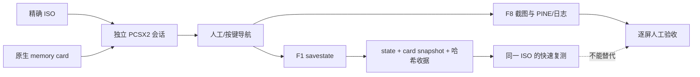

# PCSX2 存档与 savestate 测试工作流

本流程把一轮画面测试锁定到四个不可混用的对象：

```text
精确 ISO + PCSX2 v2.6.3 + 独立 memory card + 可选 savestate
```

每轮都在 `work/runtime/pcsx2-sessions/<session-id>/` 建立独立 portable
PCSX2 根。系统 PCSX2 的 `Mcd001.ps2`、`Mcd002.ps2` 不会被挂载或修改。

## 证据边界

- **memory card 是进度事实源。** 正式 fixture 必须是游戏内原生保存、具有
  明确关卡／路线状态并由运行矩阵锁定 SHA-256 的 `.ps2` 卡。
- **savestate 只是同一候选的加速缓存。** `.p2s` 包含 EE/IOP/GS 内存和
  模拟器内部状态；只能在完全相同的 ISO、PCSX2 二进制和配套 card snapshot
  上复用。
- 旧 ISO 建立的 savestate 不得用于验证新 ISO。即使只改了字库、SLPS 或
  COMPDATA，state 中也可能保留旧的已解压资源。
- savestate 会话不能补齐缺失的 memory-card fixture，也不能生成正式的
  primary runtime receipt。正式验收仍从冷启动或哈希锁定原生存档进入。
- PINE boot smoke、存档可载入、到达目标页面和截图视觉判断是四个独立门。

流程关系：



## 1. 盘点本机存档

只读扫描系统卡和外部候选：

```bash
python3 tools/audit_ui_runtime_fixtures.py \
  --search-root work/runtime/ui-fixtures/candidates/gamefaqs-srwz/cards \
  --force
```

当前四张 `17997/17998/17999/18042.ps2` 都能识别为 SRWZ 日版存档候选，
但仍是 `candidate`，不是七类正式 fixture。候选只说明卡内存在
`SLPS-25887/BISLPS-25887` 标记，不能证明它正好处于矩阵要求的页面。

## 2. 建立正式冷启动会话

当前精确存在的 P2 ISO 可运行
`fresh-boot/default-protagonist-labels`：

```bash
python3 tools/prepare_pcsx2_session.py \
  --case-id fresh-boot/default-protagonist-labels \
  --session-id p2-default-names-20260731

python3 tools/verify_pcsx2_session.py \
  --lock work/runtime/pcsx2-sessions/p2-default-names-20260731/session-lock.json
```

生成的会话具有：

- 独立 `PCSX2.app`；
- 不可变 `session-inputs/PCSX2.ini` baseline 和每次启动前恢复的
  `inis/PCSX2.ini` 工作副本；
- 独立且为空的 `memcards/`；
- 独立 `sstates/`、`snaps/` 和 `logs/`；
- 精确 ISO、PCSX2 binary、INI 和所有可选输入的大小／SHA-256；
- `EnablePINE=true`、`SaveStateOnShutdown=false`、
  `McdFolderAutoManage=false`；
- memory-card slot 1/2 默认关闭，不会回退到系统卡。使用卡时同样保留
  `session-inputs/Mcd001.ps2` baseline，每次启动前恢复工作副本。

准备工具只创建目录和锁，不启动 PCSX2。

## 3. 用候选存档探索目标页面

当矩阵要求的 P10 ISO尚未物化时，可以用当前 P2 ISO和 `17999.ps2`
探索人物／机体信息页面：

```bash
python3 tools/prepare_pcsx2_session.py \
  --case-id core/information-pages \
  --session-id p2-card17999-info-20260731 \
  --iso build/iso/ui-p2-default-names-first-five/srwz-ui-p2-default-names-first-five.iso \
  --memory-card work/runtime/ui-fixtures/candidates/gamefaqs-srwz/cards/17999.ps2 \
  --exploratory
```

工具会复制整张卡到会话自己的 `memcards/Mcd001.ps2`。原候选卡和系统卡保持
不变。由于 ISO 与存档均未晋级到该 case 的正式矩阵锁，这个会话会明确记录：

```text
exploratory = true
primary_runtime_receipt_allowed = false
```

`--iso` 只能和 `--exploratory` 一起使用，并且 ISO 必须位于 `build/iso/`。
它不会修改运行矩阵。

## 4. 命令行启动与停止

先只打印并复核 argv：

```bash
python3 tools/launch_pcsx2_session.py \
  --lock work/runtime/pcsx2-sessions/<session-id>/session-lock.json
```

实际静默启动：

```bash
python3 tools/launch_pcsx2_session.py \
  --lock work/runtime/pcsx2-sessions/<session-id>/session-lock.json \
  --execute
```

启动器使用：

```text
-portable -nogui -fastboot -nofullscreen -logfile ...
```

它等待 PINE socket，读取 PCSX2 版本、`SLPS-25887` 和 Running 状态，再把
PID 写入会话的 `process.json`。一次只能运行一个 PINE 会话。

停止：

```bash
python3 tools/stop_pcsx2_session.py --session-id <session-id>
```

停止工具先核对 PID 的命令行确实指向该会话的 PCSX2 binary，只发送
`SIGINT`；超时不会自动升级为强杀。

## 5. 无 Computer Use 的截图和 savestate

`tools/send_pcsx2_keys.swift` 向指定 PCSX2 PID 发送 macOS virtual keycode：

```bash
# F8：PCSX2 自身截图
swift tools/send_pcsx2_keys.swift <PID> 1000 100

# F1：保存当前 slot 的 savestate
swift tools/send_pcsx2_keys.swift <PID> 1000 122

# F2：切换下一个 savestate slot
swift tools/send_pcsx2_keys.swift <PID> 1000 120

# F3：载入当前 slot；正式 primary run 禁止使用
swift tools/send_pcsx2_keys.swift <PID> 1000 99
```

截图写入会话 `snaps/`，state 写入 `sstates/`。按键 helper 不读取画面、不
启动模拟器，也不使用 Computer Use。

## 6. 固化 savestate 谱系

在**从冷启动或 memory card 进入**的会话里按 F1 后，停止 PCSX2，再登记
最新 state：

```bash
python3 tools/register_pcsx2_savestate.py \
  --session-id <source-session-id> \
  --state-id information-main
```

登记工具会在 `state-bundles/information-main/` 保存：

- state 的固定副本与 SHA-256；
- 当时 `Mcd001.ps2` 的固定 snapshot 与 SHA-256；
- 源 session lock；
- ISO 大小／SHA-256；
- PCSX2 版本、binary 大小／SHA-256；
- `acceptance_scope=acceleration_only`。

复核：

```bash
python3 tools/verify_pcsx2_savestate.py \
  --receipt work/runtime/pcsx2-sessions/<source-session-id>/state-bundles/information-main/receipt.json
```

只要 ISO、PCSX2 binary、state、card snapshot 或源 session lock 有一个字节
变化，验证就会失败。

从已验证 state 建立快速复测会话：

```bash
python3 tools/prepare_pcsx2_session.py \
  --case-id core/information-pages \
  --session-id p2-info-state-recheck \
  --iso build/iso/ui-p2-default-names-first-five/srwz-ui-p2-default-names-first-five.iso \
  --savestate-receipt work/runtime/pcsx2-sessions/<source-session-id>/state-bundles/information-main/receipt.json \
  --exploratory
```

启动 argv 会使用 `-statefile`；该会话始终是 acceleration-only。

## 7. PINE probe 与稳定证据回收

正式 primary 会话应先建立 case workspace：

```bash
python3 tools/prepare_ui_runtime_case.py --case-id <case-id> --force
```

启动器会把日志直接写到 case 自己的：

```text
work/runtime/ui-cases/<case-id>/sessions/<session-id>/logs/emulog.txt
```

PCSX2 **仍在运行时**执行 PINE probe：

```bash
python3 tools/probe_ui_runtime_session.py \
  --case-id <case-id> \
  --log work/runtime/ui-cases/<case-id>/sessions/<session-id>/logs/emulog.txt \
  --fresh-process \
  --force
```

probe 同时检查精确 ISO、PCSX2、`SLPS-25887`、前后 Running、DVD、
ELF executing 和零 TLB。savestate 会话禁止使用这个 primary
`--fresh-process` 路径。

停止 PCSX2 后再回收稳定文件：

```bash
python3 tools/collect_pcsx2_session.py \
  --lock work/runtime/pcsx2-sessions/<session-id>/session-lock.json
```

它把稳定日志和所有 F8 PNG 复制到：

```text
work/runtime/ui-cases/<case-id>/collected/<session-id>/
```

同时生成 hash-only `collection.json`。这一步只证明文件稳定，不自动判断
中文是否正确，也不晋级运行结论。

只有冷启动／正式 memory-card 会话可使用 `--fresh-process` 进入最终收据。
savestate 会话的截图可用于快速定位和比较，但最终相同画面仍要从 primary
路线重新采集。

## 2026-07-31 本机验证记录

下面的会话和 state 位于被 Git 忽略的 `work/`，用于记录本次真实闭环，克隆
仓库后不会自动存在，也不是可分发资产。可提交、可重建的事实源是本页流程、
工具、测试和运行矩阵，而不是这些本机路径。

当前保留四个会话：

```text
work/runtime/pcsx2-sessions/p2-default-names-20260731/
work/runtime/pcsx2-sessions/p2-card17999-info-20260731/
work/runtime/pcsx2-sessions/p2-savestate-source-20260731/
work/runtime/pcsx2-sessions/p2-savestate-reload-20260731/
```

两者都锁定当前 P2 ISO：

```text
026f29e3e77b78a19f000c6781317ebc95aeb672b5b2848ad2a30bf8d2f5c473
```

第一份是可作为 primary 的 fresh-boot 会话，已经实际完成一次
`launch -> PINE probe -> SIGINT -> collect`：

```text
PCSX2 v2.6.3
SLPS-25887
PINE Running
DVD = true
ELF executing = true
TLB miss = 0
```

它没有采集目标页面截图，因此 case 仍为 `not_tested`。第二份使用
`17999.ps2`，只作信息页探索，目前尚未启动。

第三、四份完成了真实 savestate 闭环：

```text
cold boot -> PINE ready -> F1 -> SIGINT -> register -> verify
          -> prepare -statefile session -> PINE ready -> SIGINT
```

冻结 state 位于：

```text
work/runtime/pcsx2-sessions/p2-savestate-source-20260731/
  state-bundles/pine-ready-smoke/state.p2s
```

其大小为 `4,817,387` 字节，SHA-256 为：

```text
0515180be0e80141b26ac62b991baa13eb1960a3f9d0bde79a6efa29b3f330af
```

重载会话已实际通过同一 ISO、同一 PCSX2 binary 的 `-statefile` 启动并重新
取得 `PCSX2 v2.6.3 / SLPS-25887 / PINE Running`。它只证明工作流可复用，
没有采集目标画面，也不构成任何 UI 验收。PCSX2 日志同时提示当前模板启用了
MTVU，state 在不同宿主调度下可能不稳定；因此该 state 继续严格标记为
`acceleration_only`，一旦载入失败就回到冷启动／原生存档，不据此降低正式
验收门槛。

当前没有运行中的 PCSX2。
