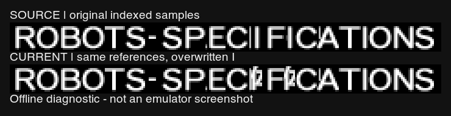

# 图鉴 ROBOTS-SPECIFICATIONS 共享字母贴图回归

版本归属：[v0.4.2 发布后问题台账](V0.4.2_POST_RELEASE_ISSUES.md)。

2026-09-29。当前状态：**已复用 PILOT 的 I 修复共享引用；三版最新 current／daily-test ISO
已完整构建并回读通过，三份独立 CHD 已压缩、校验及解压哈希比对通过。**

三版独立候选的 LRPS2 冷启动目标场景均通过，SP 与日版标题区域像素完全一致。
最终 ISO 的 KVM／KVP 与已测试候选逐成员相同；最终整盘及 CHD 未重跑运行测试，
PCSX2／人工验收待完成。修复候选保留于 `build/iso/robot-specifications-20260929/`。
最新产物见文末；尚未提交或推送。以下先保留初次定位证据，再记录后续修复。

用户提供魔神 Z 机体图鉴截图，指出背景标题 `ROBOTS-SPECIFICATIONS` 显示异常。
修复前 ISO 回读确认：`SPECIFICATIONS` 中两个 `I` 共用 `SHIP` 一词内的字母贴图，
而 `SHIP → 机体` 的中文替换覆盖了这个区域。当时 Original、The Best、SP 三版均有
相同覆盖，能够静态重现截图中的字母碎片。

用户截图未附 ISO 路径、哈希或模拟器信息，不能据此指定截图来自哪一版。
初次定位阶段只做了实际成员回读和证据登记；后续修复及运行结果见文末。

## 具体资源与原因

| 项目 | 已核实内容 |
| --- | --- |
| 像素资源 | `KURODATA/KVMDATA.BIN` 第 2 页，256×256、4bpp，页起点 `66688` |
| 中文替换 | `config/assets/ui-info-atlas-zh.json`，`SHIP → 机体` |
| 替换矩形 | `x=80, y=0, width=49, height=16` |
| 共享字母 | `I`，半开 UV `[106,0,112,16)`，6×16＝96 个索引像素 |
| 实际覆盖 | 其中 **72 个**索引像素相对原盘变化；修复前三版内容相同 |
| 因果核对 | 修复前 ISO 的 `I` 区域与 `ui-info-atlas-zh` 组件对应区域逐字节相同 |
| 元数据／调色板 | 三版第 2 页的 TIM2 头、CLUT 和尾部相对各自原盘保持一致 |

初次定位时，Original／Best 的 `KVPDATA.BIN` 标题绘制记录全部保持原盘字节；两处 `I` 记录偏移为
`0x1DEF8`、`0x1DF24`。Original 原生图元表位于 ELF 文件偏移 `0x32DDD0`，对应
第 1088 块 `[0x1DE00,0x1DF80)`；Best 的记录偏移由其自身原盘回读核对，未套用 ELF 地址。

SP 对应第 1115 块。两处 `I` 各有主色／阴影两条记录，偏移为
`0x2077A`、`0x20790`、`0x207D2`、`0x207E8`；初次定位时 26 条标题记录均与 SP 原盘一致。
现有 SP 标题撤回恢复的是原版绘制记录，无法恢复先前已被中文基础组件覆盖的共享像素。

对标题引用的全部词段逐一比较，只有这两次使用的同一个 `I` 区域变化；其他片段保持原盘
索引像素。这里的 72 是唯一贴图区域变化量，不因重复绘制而累计。

## 证据

- [用户原始截图](issue-assets/robot-specifications-20260929/user-report.png)
- [三版原盘／当前 ISO 成员回读及逐条记录](issue-assets/robot-specifications-20260929/readback.json)
- [只读复核脚本](issue-assets/robot-specifications-20260929/audit.py)



上图按实际 UV 和横向绘制位置重组原始索引像素，统一使用灰度映射及最近邻采样，以便
观察字形。**它是离线诊断图，不是模拟器截图，也不模拟 GS 的颜色、阴影和过滤。**

初次回读覆盖以下实际文件；JSON 保存修复前各 ISO 的路径、大小、修改时间，以及实际读出的
KVM／KVP 成员长度、LBA 和 SHA-256。初次定位没有计算完整 ISO 哈希，也没有检查发布补丁包。

| 版本 | 当前 ISO | 受影响绘制记录 |
| --- | --- | ---: |
| Original | `build/iso/zh-release-original/current-original.iso` | 2 |
| The Best | `build/iso/zh-release-best/current-best.iso` | 2 |
| Special Disc | `build/iso/special-disc/sp-current.iso` | 4（2 字母 × 主色／阴影） |

初次定位时在仓库根目录执行：

```sh
python3 docs/issue-assets/robot-specifications-20260929/audit.py
```

脚本读取原盘、current ISO 和已有组件，写入本诊断的 JSON／对照图；使用当时本机的
ImageMagick 与系统 Helvetica 字体。它要求修复前的输入，任何像素、标题记录或格式前像
不符会中止；当前 ISO 已更新，不应直接重跑该历史脚本覆盖初次定位证据。

## 后续修复：复用 PILOT 的 I

用户指出可以从 `PILOT` 读取 I。核实后直接采用该方案，保留全部现有图集像素。

- 字母来自同一页 `PILOT` 的 UV `[14,16,19,32)`，宽 5、高 16。
- 将其左侧补一列透明像素后，96 个索引值与原 `SHIP` 的 I **完全相同**。
- 如果直接截取 `[13,16,19,32)` 的六列，会带入左侧 P 的 4 个像素，因此只取后五列，
  并把绘制左边界右移 1 像素。右边界保持原位置，字形和字间距保持原样。
- Original／Best 修改两条原生 sprite 记录；SP 修改主色和阴影共四条记录。
  图元类型、标志、材质、颜色、纵向位置及结束标志均保持原样。
- Original／Best 由 `tools/srwz/ui_headings.py` 的独立共享字母校验步骤写入；SP 复用
  原有 `title_atlas.py` 的只读字块和引用重定向流程。没有新增或重绘任何像素快照。

| 版本 | 候选 ISO | 全盘实际改变的字节数 |
| --- | --- | ---: |
| Original | `build/iso/robot-specifications-20260929/original.iso` | 10 |
| The Best | `build/iso/robot-specifications-20260929/best.iso` | 10 |
| Special Disc | `build/iso/robot-specifications-20260929/sp.iso` | 20 |

每版均核对所有成员的 LBA／长度、KVP 实际回读及其余完整 ISO 字节，确认只有所列引用
变化，KVM 整个成员不变。候选完整 SHA-256 和逐字节差异见
[candidate-readback.json](issue-assets/robot-specifications-20260929/candidate-readback.json)。
候选装配脚本见 [build_candidates.py](issue-assets/robot-specifications-20260929/build_candidates.py)，
它拒绝覆盖既有候选文件。

19 项相关测试通过：`tests.test_ui_headings`、`tests.test_special_disc_title_atlas`、
`tests.test_special_disc_command_headings`。覆盖字母索引锁、非目标字节、图元颜色／
几何保护、错误前像拒绝和 SP 重复构建一致性。主版本贴图组件已构建，相关输出锁已同步。

## 三版 LRPS2 运行证据

每版使用独立 LRPS2 进程及记忆卡副本，从冷启动通过按键自然进入资料库、机体图鉴、
魔神 Z。未载入旧即时存档，未修改 RAM；截帧后只读导出 RAM，确认两条／四条修复后
记录各出现一次，旧记录为零。三版目标标题的两个 I 均正常。

- [完整运行回执](issue-assets/robot-specifications-20260929/runtime.json)
- [Original 画面](issue-assets/robot-specifications-20260929/original-lrps2.png)
- [The Best 画面](issue-assets/robot-specifications-20260929/best-lrps2.png)
- [SP 画面](issue-assets/robot-specifications-20260929/sp-lrps2.png)


上述结论对应候选 ISO 的静态和 LRPS2 目标场景验证；尚无本轮 PCSX2／人工验收，
不能替代最终 current 镜像的完整运行测试，也未覆盖既有发布补丁。

## 日版同场景复核

用户随后要求查看日版。已核对未修改 SP 日版原盘的完整 SHA-256 与版本注册表一致
（`c3bd8c1af4e411e5ab2ae2d4be877170b6ab1ea9b51fa62bc0b91a51ba1a2952`），
使用相同 LRPS2 软件渲染器、记忆卡来源副本和按键序列冷启动，到第 2580 帧的魔神 Z 图鉴页。

日版与修复候选的标题区域 `x=20,y=170,width=238,height=20` 共 4,760 个 RGBA 像素
**完全相同，差异为零**，包括两处 I 的位置、字形和阴影。这提供了运行截图层面的原版对照。

- [未修改 SP 日版画面](issue-assets/robot-specifications-20260929/sp-japanese-lrps2.png)
- [原盘身份与逐像素比较回执](issue-assets/robot-specifications-20260929/japanese-comparison.json)

## 最新三版 ISO 与 CHD

用户确认修复后，通过 `python3 -u tools/build_editions.py` 从同一份冻结的最新工作区输入
完整构建 Original、The Best、SP，耗时 668.175 秒。输入摘要为
`a16e102efc02093e31d3e636c92ee614e61cefd8069052ca19a5d812928e647b`。
三版静态内容回读及 current／daily-test 副本一致性均通过。

| 版本 | 最新 ISO | 独立 CHD | CHD 字节数 |
| --- | --- | --- | ---: |
| Original | `build/iso/zh-release-original/current-original.iso` | `build/iso/daily-test/current-original-skip.chd` | 2,560,016,376 |
| The Best | `build/iso/zh-release-best/current-best.iso` | `build/iso/daily-test/current-best-skip.chd` | 2,557,265,262 |
| Special Disc | `build/iso/special-disc/sp-current.iso` | `build/iso/daily-test/current-sp-skip.chd` | 2,608,436,088 |

`build/iso/daily-test/current-{original,best,sp}-skip.iso` 已同步为对应 current ISO 的逐字节副本。
最终三版的 `KVMDATA.BIN` 和 `KVPDATA.BIN` 均与此前 LRPS2 候选完全相同；同时重新核对
最终 ISO 内两条／四条 I 引用及 PILOT 供体索引像素，全部通过。

使用 `chdman 0.289` 的 `createdvd -c zlib -hs 16384` 生成三份无父盘依赖的 CHD。
每份均通过 `chdman verify`，再用 `extractdvd` 解压，完整 ISO 大小和 SHA-256 与对应
current／daily-test ISO 一致。三份全部通过后才替换旧 CHD；压缩及往返验证共 176.583 秒。
验证用临时 ISO 已删除，正常 ISO 和独立修复候选均保留。

- [完整构建与回读回执](issue-assets/robot-specifications-20260929/production-build.json)
- [最终资源与 LRPS2 候选比较](issue-assets/robot-specifications-20260929/current-vs-candidate-resources.json)
- [三份 CHD 身份与往返校验回执](issue-assets/robot-specifications-20260929/production-chds.json)
- 当前 CHD 清单：`build/iso/daily-test/current-chd-manifest.json`

这次交付证明最终 ISO 的静态内容和 CHD 无损往返一致性；最终整盘及 CHD 尚未重跑模拟器，
运行证据仍限定为上面的候选 LRPS2 目标场景。既有冻结发布产物未重建。
