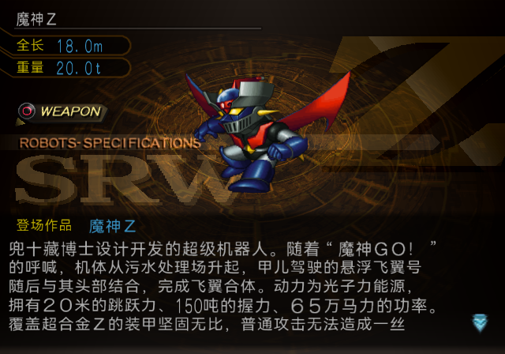

# ROBOTS-SPECIFICATIONS 生产修复与当前成品验证

2026-10-03。共享 I 修复已提交为 `6696e9ecde8136c2da47bd73da68a9167373125f`，
并从该提交的隔离工作区完整构建 Original、The Best、Special Disc。三版 current ISO
及 daily-test ISO 已同步；本轮 LRPS2 目标场景使用这些成品的完全相同字节，三版均通过。
PCSX2／人工验收仍待完成。本记录只验收本次共享 I 问题。

## 原因与生产输入

`SHIP → 机体` 覆盖了 `SPECIFICATIONS` 借用的两个 I。旧引用采样同一页的
`[106,0,112,16)`，96 个索引像素中 72 个已改变。修复改用 `PILOT` 内的
`[14,16,19,32)`（5×16），左边界右移 1 像素，右边界保持原样。补回透明左列后，
与原版 I 的 96 个索引完全一致，不需要重新绘制图集。

2026-09-29 21:04（UTC+8）的生产批次确实包含修复；23:55 完成的社区投稿构建
排除了尚未提交的修复代码和配置，再次覆盖同名 current。后续构建沿用该输入，
因此出现“修复过，但当前盘仍是旧引用”。本次提交包含两版配置、生产构建代码、
组件锁和测试，随后以提交内容完整构建，避免修复仅存在于脏工作区。

新批次输入摘要：
`4579af084268edb763f2193418d53443e80c1ad65cb868a0639b98c66b98ee3b`。
生产批次及实际回读见 [manifest](../manifests/editions/specifications-20261003.json)。

## 当前输出

| 版本 | current ISO | 日常测试 CHD |
| --- | --- | --- |
| Original | `build/iso/zh-release-original/current-original.iso` | `build/iso/daily-test/current-original-skip.chd` |
| The Best | `build/iso/zh-release-best/current-best.iso` | `build/iso/daily-test/current-best-skip.chd` |
| Special Disc | `build/iso/special-disc/sp-current.iso` | `build/iso/daily-test/current-sp-skip.chd` |

`build/iso/daily-test/current-{original,best,sp}-skip.iso` 与对应 current ISO 的大小及
完整 SHA-256 相同，既有战斗跳过功能也通过静态回读。

| 版本 | 完整 ISO SHA-256 | 修复引用数 | KVP 改变字节数 |
| --- | --- | ---: | ---: |
| Original | `7fe44eec06c789ade6895f8c27a9aa1306b5b0ada5a7517ea576fcdf9c9f008c` | 2 | 10 |
| The Best | `1871c77bebcdc080808f13bc1e05c2c5fb46daae7c5ec9229271a4aa14e9c1c6` | 2 | 10 |
| Special Disc | `5cdf8234e0bc9eff148cd1e14dc8b395e6a9c936345b9b0217b1c50766952b62` | 4 | 20 |

改变字节数仅指相较修复前 current 的 **整个 KVPDATA.BIN 成员**。三版 KVP 除这
8 条目标引用中的 UV 和左边界外，全部字节相同；KVMDATA.BIN 整个成员完全不变。
因此图集索引、透明度、CLUT、尾部数据，以及标题主色／阴影字段均保留。
全部成员 LBA 与各自原盘一致。整盘还包含此前已提交的 10 月 3 日文本基线，
不能把 10／10／20 宣称为整盘总变化量。

## 验证范围

- 19 项相关测试通过，覆盖索引锁、非目标字节、颜色和几何保护、错误前像拒绝、
  SP 重复构建一致性。
- 全量测试执行 639 项，9 项跳过，结果通过。隔离输入准备完成后执行；此前源 ISO
  尚未准备完成的运行已被此结果取代。
- 三版完整静态内容回读、批次输入和实际 ISO 身份绑定验证通过。
- 每版独立 LRPS2 Software 进程冷启动，通过正常按键进入资料库 → 机体图鉴 → 魔神 Z。
  未恢复即时存档，未写 RAM。只读导出的 RAM 中，修复后记录各出现一次，旧记录为零；
  来源记忆卡前后 SHA-256 相同。
- LRPS2 使用隔离工作区内生成的最终 ISO；发布到主工作区的 current ISO 完整 SHA-256
  与其相同。验收证据明确绑定本次最终成品，而不是沿用 9 月 29 日候选结论。
- 三份 CHD 使用 `chdman 0.289`、`zlib`、16,384 字节 hunk，无父盘依赖。
  每份完整校验后解压回 ISO，完整大小和 SHA-256 与当前 ISO 相同，全部通过后才发布。
  CHD 本身未单独运行模拟器。

验证材料：[成员回读](issue-assets/specifications-production-20261003/readback.json)、
[只读复核脚本](issue-assets/specifications-production-20261003/verify_readback.py)、
[测试结果](issue-assets/specifications-production-20261003/tests.json)、
[LRPS2 运行回执](issue-assets/specifications-production-20261003/runtime.json)、
[CHD 校验回执](issue-assets/specifications-production-20261003/chds.json)。

本轮没有 PCSX2／人工验收，也未验证全部菜单、剧情和战斗流程。
FORMATION 的其他共享字块覆盖继续保留在对比页，未由本项验收代替。
既有冻结发布快照和发布补丁未重建。
