# SP 待机／不可用提示平面柔边修正

版本说明：下文各次修订的图像／哈希保留为历史证据。最终版本已冻结并写入主篇与 SP 当前镜像，最新身份及主篇自然事件证据见 [定稿与 ISO 写入记录](TRICMN_BATTLE_OVERLAYS_FREEZE_20261004.md)。

本次只调整 TRICMN picture 1 中 10 条提示：待机、无目标、战斗不能、无法攻击、（弹数）、（缺人）、（地形）、（气力）、（射程）、（能力）。原版（EN）的索引像素保持一致，作为材质对照；其他 41 条文字、箭头、数字、CRITICAL、CLUT、TIM2 头和尾部动画数据保持原像素／原字节。

采用 `en_prompt_soft_layers` 作者渲染模式。完整覆盖的笔画统一使用平面填色，部分覆盖按固定色阶过渡，描边／柔边独立使用原有索引材料。取消方向光照和挤出侧面（shadow offset 为 0,0），不使用按字形直方图排序的材料分配。笔画扩展分别为 1.2、1.0、0.8；径向柔边半径为 2；字体、字号和文字区域保持原规格。

## 同条件对照

每行：修改前、修正版、原版（EN）。相同共享 CLUT、像素比例与线性采样，3 倍放大。

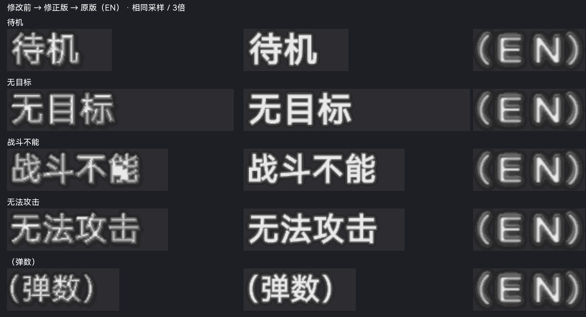

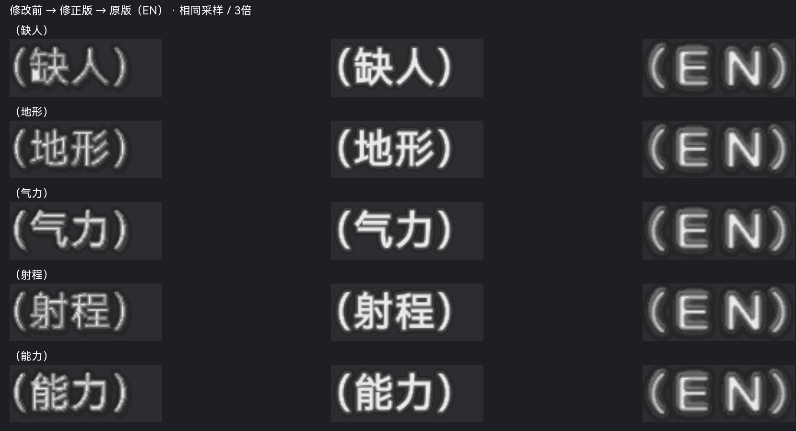

10 条均复看灰白调色深背景及蓝色调色亮背景。密集笔画与斜线的填色更连续，未观察到裁字。本节为静态对照；下节另记录随后完成的原生事件和借槽运行测试，PCSX2 手工验收仍待完成。

## 原生事件与 10 条文字运行对照

2026-10-04 补做 LRPS2 Software (SW) 运行验证。SP 普通模式和主篇旧 Continue 档均可触发本组大号提示；菜单中的小字号“待机”不作为这张贴图的证据。整个流程只使用正常手柄操作及读取／恢复 LRPS2 状态，没有修改 EE RAM、战斗结果标志或可执行代码。

### SP 战斗鉴赏普通模式

选择普通模式，在**反击方的小队长武器**中选“射程不足”，先攻方保留有效武器，即可观看正常攻击后出现的“无法攻击（射程）”。列表还提供“弹药耗尽／EN 不足”；本次实际捕获的是射程条件。若把先攻方小队长设为不可用，鉴赏界面会提示“先攻方未选择武器，无法开始战斗”，因此要把不可用条件放在反击方。

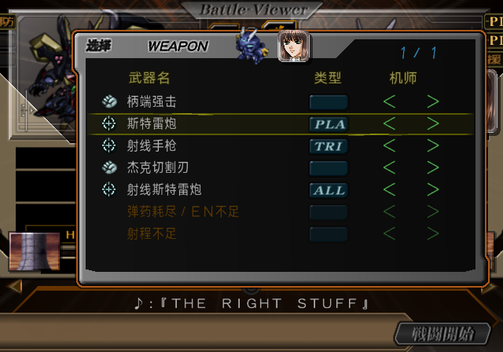

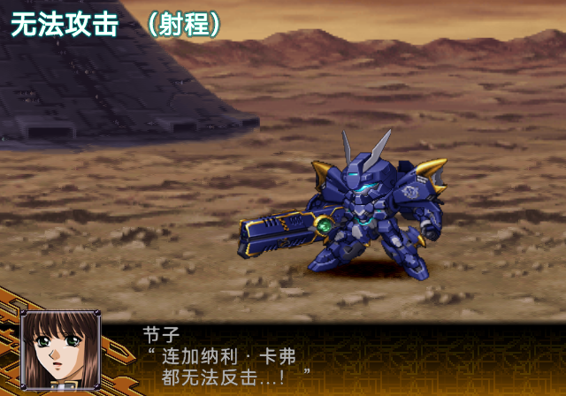

取消队员参与的勾选会移除该队员，不能用来代替未能攻击原因的测试。原生绘制入口 `FUN_002ee6f0` 由战斗结果中的原因编号选择提示／原因 UV；普通模式构建器 `FUN_00448dc0` 保留相应的不可用原因。证据脚本与只读反编译输出位于 `work/analysis/prompts-native-trigger-20261004/`。

### 主篇旧 Continue 档

找到并恢复两份历史卡副本。第 6 回合地图能正常 Continue，但主力距离敌军较远；最终使用 2026-09-14 单位菜单验证留下的都市关卡第 2 回合卡：

- 路径：`work/runtime/lrps2/headings-v6-unit-menu-20260914/save/current-original.ps2`。
- 源卡 SHA-256：`8880c03560fa0d436d005d8c9dde199239820a03c5106eecdb273186fcaabff0`。
- 在私有卡副本中 Continue，切到仍可行动的王者盖纳，选择“超限冻弹”，选择凯鲁宾兵目标，再选分散阵型，开启完整演出。
- 两名猎豹队员没有对应目标，自然显示“无目标”；敌方无法在当前射程反击，随后自然显示“无法攻击（射程）”。
- “无目标”截图：帧 6104；“无法攻击（射程）”截图：帧 7544。战斗前可恢复状态帧为 5737。

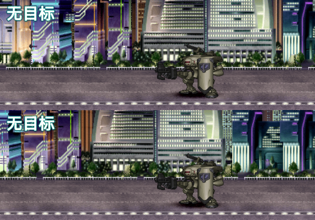

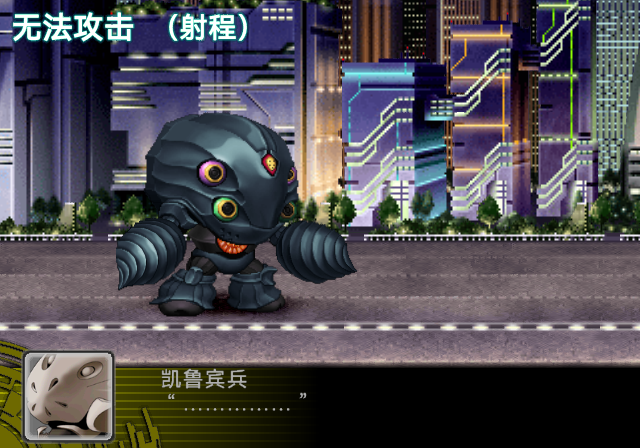

主篇运行使用 `work/analysis/prompts-native-trigger-20261004/main-prompts.iso`：从当前主篇生产 ISO 克隆，仅迁入这 10 条冻结提示的 25,069 个纹素。主篇生产 ISO 未重建。本场“超限冻弹”还在帧 7304 自然触发了“运动性下降”，可作为状态文字的后续测试入口；本次不把旧状态贴图的这张截图算成状态修正版通过。

### 10 条字形借槽检查

在已正常触发的 SP“无法攻击”槽、主篇“无目标”槽中，逐项替换待机、无目标、战斗不能、无法攻击、（弹数）、（缺人）、（地形）、（气力）、（射程）、（能力）。只复制冻结的 4-bit 索引字形，保持原尺寸；使用游戏自己的 CLUT、透明混合、位置和上下两路小队演出。SP 为展示单条字形清空该事件的射程原因槽。所有实验仅修改独立测试 ISO。

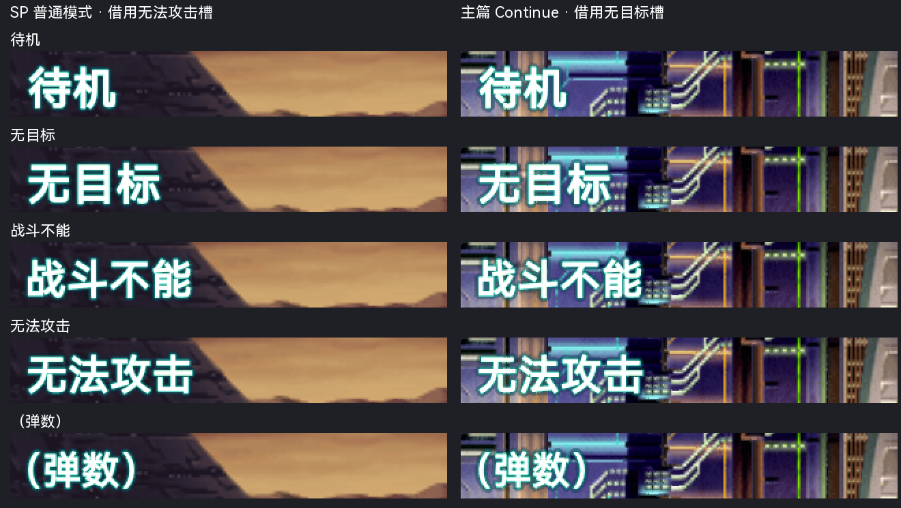

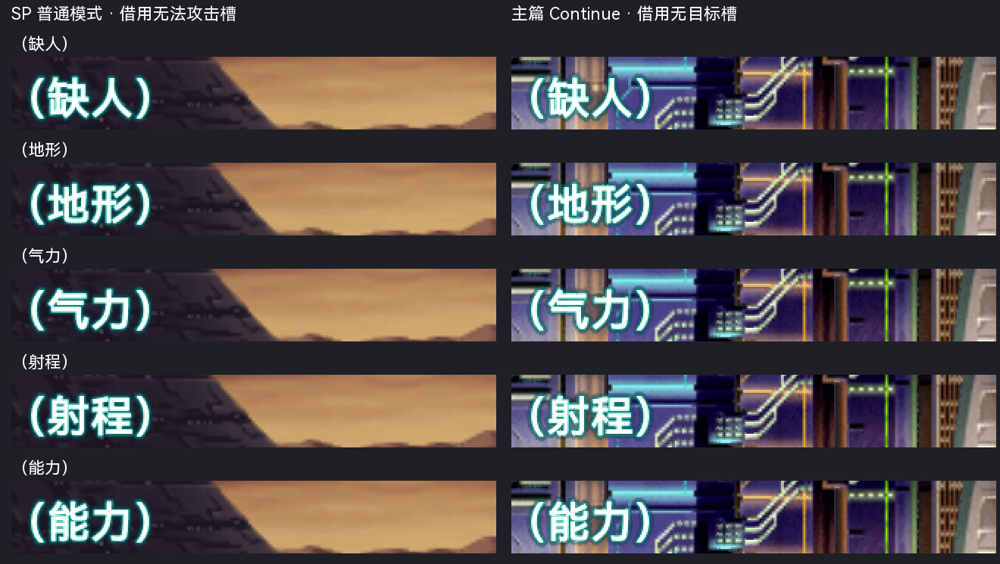

20 组运行截图已逐项复看：笔画填色连续，未观察到透底破洞、碎边或裁字，亮／暗背景下保持平面填色。另将原版（EN）的索引像素放入同一 SP 槽作为材质对照：

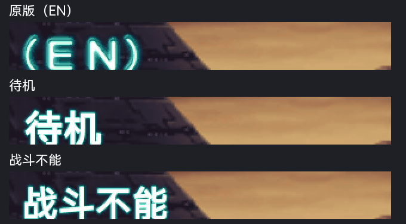

这证明 10 条冻结字形在两个实际提示显示流程中的外观；不等于 10 种游戏原因都分别自然触发。自然事件已验证“无目标”和“无法攻击（射程）”，其他原因的独立触发、完整淡入淡出过程及 PCSX2 手工验收保留为后续项。

可复现证据：`main-native-receipt.json`、`ten-fixture-runtime.json`、`main-ten-fixture-runtime.json`、`fixture-readback-proof.json`。20 个测试 ISO 的成员均已回读；变化仅在借槽区域，其他纹素、CLUT、TIM2 头和尾部数据保持一致。3 份源记忆卡的运行前后哈希一致。运行截图和 LRPS2 状态位于 `work/runtime/lrps2/prompts-native-trigger-20261004/`。本次未修改主篇／SP 生产 ISO 或冻结快照，也未提交或推送。

## 构建与保护验证

- 26 项测试通过：`python3 -m unittest tests.test_tricmn_battle_overlays tests.test_special_disc_battle_status tests.test_psmt4`。
- 完整 51 条作者渲染输出与只替换 10 个冻结文字区域的候选成员字节一致；普通构建继续消费冻结索引快照。
- 本次修改 25,069 个纹素，全部位于上述 10 个提示区域；主篇冻结成员与 SP 成员均逐像素核对区域外一致，包括原版（EN）及 10 条状态文字。
- 主篇冻结成员 SHA-256：`c661e86bab9c22ce680a7c8e823cbb49e2fc6b1d41142dc7211f0a9bd2e12dcd`。主篇 ISO 未重建。
- 当前 SP 成员 SHA-256：`4bfd8bcd7a4662d4a38f2f49adace7504ffd4017901e3ce477525ecc3f611b15`。
- 当前 SP ISO SHA-256：`301dfc4380ce4c46a2a1e11b5b5850b64d2638ba6a62cbb0635464d82884a626`。
- 当前 ISO 成员已回读，与对照图使用的修正版候选字节一致。目录、成员大小和 LBA 保持一致；整张 ISO 在 picture 1 图像范围之外逐字节比较一致。
- SP 全量构建在状态文字迁移之后应用冻结提示区域，独立验证同时检查两组文字。当前镜像采用范围受限更新，保留之前的文本验证来源；本次未重新运行旧构建目录不可用的 SP 全量文本验证。

可复现记录：`work/analysis/sp-prompts-en-adjust-20261004/authoring.json`、`boundary-proof.json`、`final-readback.json`、`production-update/production-readback.json`。当前镜像的范围受限更新入口：`tools/special_disc/writeback/refresh_battle_prompts.py --evidence <新证据目录>`。

## EN 光晕补正

用户指出第一次运行对照中的中文缺少原版（EN）的光晕。旧版将字外过渡限制在较暗的 1～7 索引，加上只有 2 像素的径向扩散，呈现为较硬的轮廓。此次将字外亮度过渡延伸到中间亮度索引 8～12，并保留外圈 1～3 的低透明度尾部；径向扩散半径由 2 调为 4。实心笔画仍固定使用 15，字号／字体不变，偏移仍为 0,0，没有方向光照或挤出侧面。

这 10 条均已在主篇 Continue 自然触发的“无目标”槽中重新拍摄；另外在 SP 普通模式已触发的槽内重拍“待机”“战斗不能”，与上一版和原版（EN）比较。下图左侧为上一版，右侧为光晕补正；原版（EN）像素未修改。展示截图保留字外空白，未裁掉文字或外光晕。

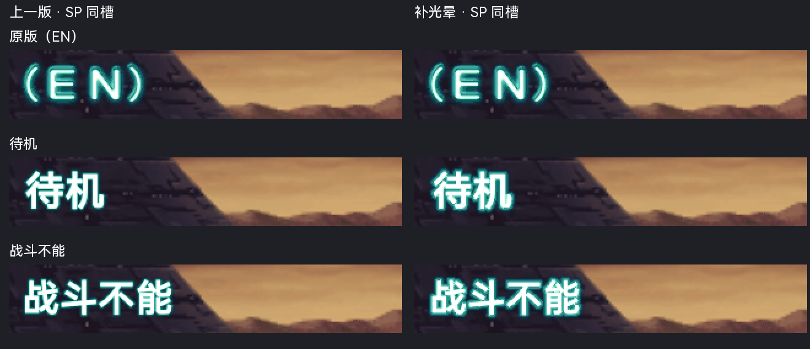

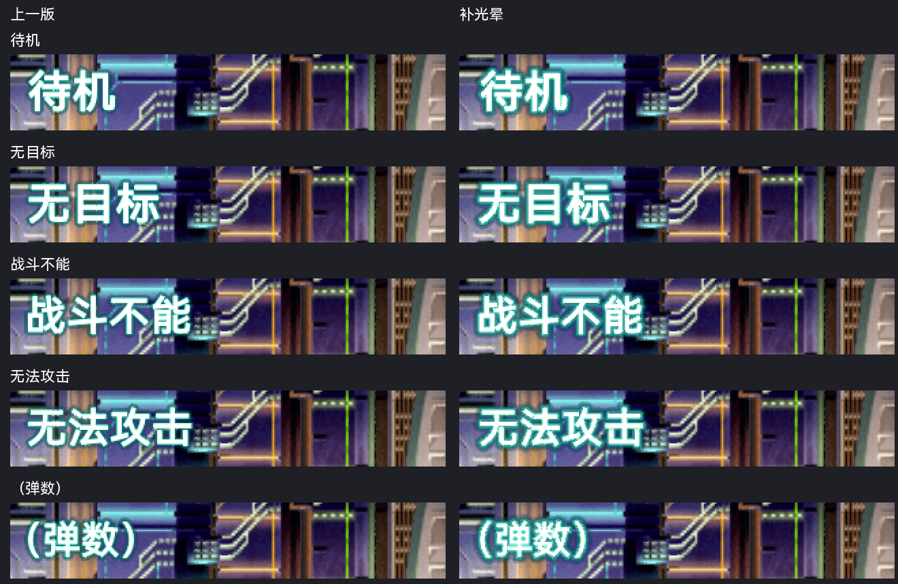

[补光晕后的前五条](issue-assets/battle-prompts-20261004/glow-main-ten-1.png) · [补光晕后的后五条](issue-assets/battle-prompts-20261004/glow-main-ten-2.png)

完整 51 条作者输出与仅替换 10 条的候选成员完全一致，随后重新冻结。相对上一版改动 25,199 个纹素，全部位于这 10 条提示区域；其他 41 条、原版（EN）、CLUT、头与尾部数据保持一致。SP 当前镜像已经范围受限更新，目录／LBA／成员大小保持一致，图像区域之外的整张 ISO 字节也核对一致。主篇冻结组件已同步，主篇生产 ISO 未重建。

- 新主篇冻结成员 SHA-256：`00b6de888086ea5198bbf166612c7961cc818288f11cebff3de64d283691253b`。
- 新 SP 成员 SHA-256：`9e2031d7d190ea5c2a7405b147ca6ba11ff35d9a87953718fc131f86755c241f`。
- 新 SP 当前 ISO SHA-256：`3265643bfd1f9a488a7a7805a1914d1ddcf08af6ad2543750f794ff005884c69`。
- 28 项测试通过：`python3 -m unittest tests.test_tricmn_battle_overlays tests.test_special_disc_battle_status tests.test_psmt4`；输出留存于 `work/analysis/sp-prompts-en-glow-20261004/tests.log`。
- 作者／范围证明：`work/analysis/sp-prompts-en-glow-20261004/authoring.json`、`boundary-proof.json`、`main-ten-runtime.json`、`production-update/production-readback.json`。
- 运行记录：`work/runtime/lrps2/sp-prompts-en-glow-20261004/`；证据为 LRPS2 Software (SW)，PCSX2 手工验收仍待补。

更新后的 SP 当前生产镜像另用普通模式原生事件复跑“无法攻击（射程）”，在帧 10062／10102 捕获本身槽位的提示与原因文字；未改 RAM，源记忆卡保持不变。记录：`work/runtime/lrps2/sp-prompts-en-glow-20261004/production-native-range/receipt.json`。

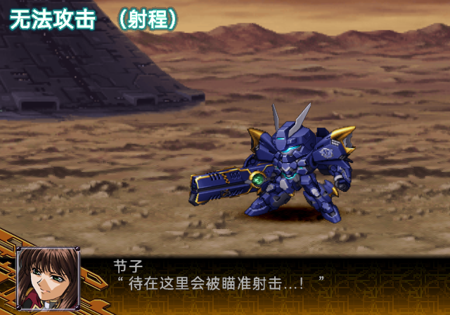
