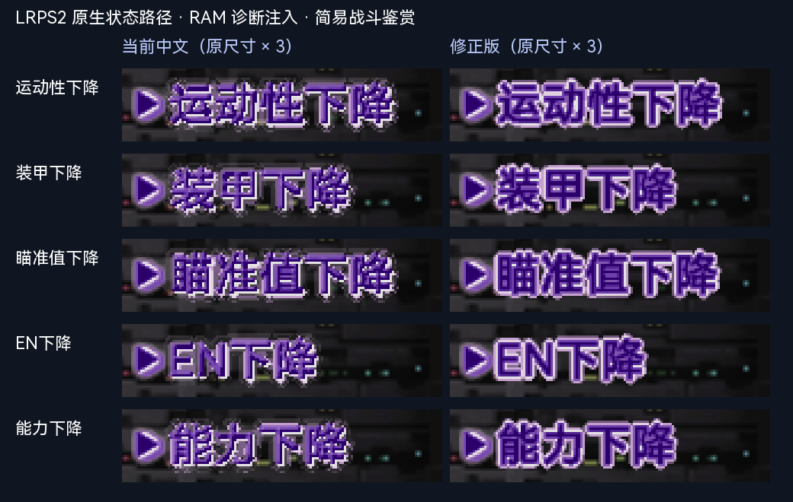
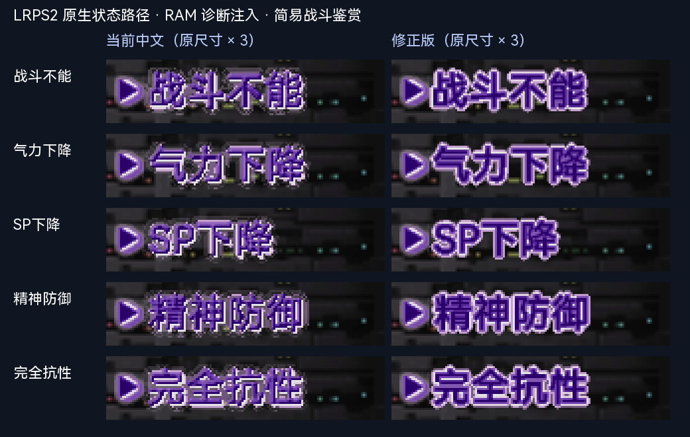

# SP 战斗状态文字边缘修正

最终版本已冻结并写入主篇与 SP 当前镜像；主篇当前镜像新增“运动性下降”的自然触发证据。最新身份与验收边界见 [定稿与 ISO 写入记录](TRICMN_BATTLE_OVERLAYS_FREEZE_20261004.md)。

后续版本说明：本记录中的成员／ISO 哈希属于该次修订。当前镜像已继续应用 [阵型／攻击标题修正](SP_BATTLE_TITLES_TEXTURE_20261004.md)，本组文字的像素保持一致；最新镜像身份以该记录为准。

后续待机等 10 条提示已另行修正，最新镜像身份见 [提示文字修正记录](SP_BATTLE_PROMPTS_TEXTURE_20261004.md)。下文镜像哈希记录状态组修正完成时的版本；状态文字像素在后续更新中保持一致。

本次只调整 TRICMN 中的 10 条状态／抵抗文字：运动性下降、装甲下降、瞄准值下降、EN下降、能力下降、战斗不能、气力下降、SP下降、精神防御、完全抗性。阵型 12 条、待机等大字 10 条及能力／防御文字保持原像素。

原生状态绘制使用的 CLUT 索引并非按亮度递增。游戏内色条确认：1..6 为紫色笔画，13/15 为亮边，7..12 为柔边。旧的直方图分配会让亮色索引散进笔画，并让柔边索引落入笔画主体，形成白点、碎边和透底感。

新作者渲染模式按覆盖率先分配笔画、描边、柔边材料，再选各层的色阶。描边宽度为 2.4，笔画扩展为 0.65，外发光半径为 1；取消 EN、SP 单字亮边补偿。原箭头、CLUT、TIM2 头、其他文字、动画和尾部数据保持一致。修正版已冻结；普通构建继续读取索引快照，不重新栅格化。

## 画面对照

左为修改前，右为修正版，最近邻放大 3 倍。

10 条均在 LRPS2 Software (SW) 原生状态／抵抗绘制路径中截取，包含稳定显示和后续两帧位置（5531、5581）。笔画填色及描边连续性明显改善，未见裁字；源记忆卡 SHA-256 未变。

这组画面属于 **3 字节 RAM 诊断注入**。原版 SP 战斗鉴赏构造命中结果时，`FUN_00448930` 清零附加状态标志；`FUN_00303380` 只在该标志非零时调用状态绘制。实际运行 Mk-II 火神炮、魔神 Z 的ルストハリケーン均未自然出现下降提示。状态文字自然触发和 PCSX2 验收继续为 pending，生产程序未加入诊断补丁。

## 构建与验证

- 冻结贴图主篇成员 SHA-256：`bb62d1248990f92540f63300b8b36f07c27aa842c8a1efe797c96010d72dfbe9`。
- 当前 SP `BTL/TRICMN.BIN` SHA-256：`431c9f84b45c6c181e7ef9e766f95cdf91bf3cefbc8594b063bb47ad2703f6b7`。
- 更新前 SP ISO：`02173a6d7108067e30a02f34e5d1d6bacc579e6650c77b71138fc77cd57b7d46`。
- 更新后 SP ISO：`da25fbc39ce7a112361d7e3dc93b68328b151b2e4fa26b89a7fe43520c5b665c`，与截图所用修正版 ISO 字节一致。
- 修改 15,711 个文字纹素，全部位于 picture 1 的 10 个 `113 × 24` 区域。区域外逻辑像素及 3,791,716,352 个非图像范围的 ISO 字节保持一致；目录、成员大小和 LBA 不变。
- `python3 -m unittest tests.test_tricmn_battle_overlays tests.test_special_disc_battle_status tests.test_psmt4`：24 项通过。
- 冻结构建、SP 状态单元回读、重复应用不改变输出、破坏单元拒绝回读、ISO 全范围保护比较通过。

SP 全量构建在最后一步从主篇冻结快照复制这 10 个文字区域，保留 SP 自身箭头、调色表和新增内容。当前镜像使用范围受限的资源更新，保留旧文本验证的来源，并通过全镜像字节保护证明其他内容未改变。当前主篇 ISO 未在本次重建。

相关入口：

- `config/assets/tricmn-battle-overlays-zh.json` 和对应 render snapshot。
- `tools/srwz/tricmn_battle_overlay.py`：作者渲染材料分配。
- `tools/special_disc/writeback/battle_status.py`：冻结单元迁移和回读。
- `tools/special_disc/writeback/refresh_battle_status.py --evidence <新证据目录>`：当前 SP 镜像的范围受限更新；更新前核对镜像身份，更新后保护比较和回读。
- `work/analysis/sp-status-native-20261004/fixed-review.html`：修改前、修正版、日文参考及完整截图。
- `work/analysis/sp-status-native-20261004/production-update/production-readback.json`：当前镜像更新记录。

本机未保留当前镜像清单指向的原始构建目录 `build-shx6pu1e`。因此本次没有将旧文本验证冒充为重新全量运行；后续全量构建使用已接入的状态单元迁移步骤。
