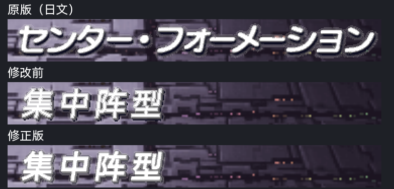
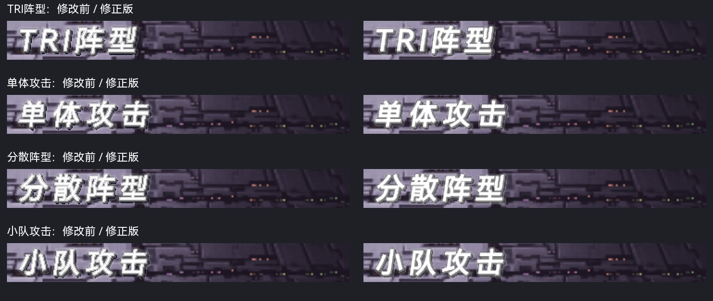
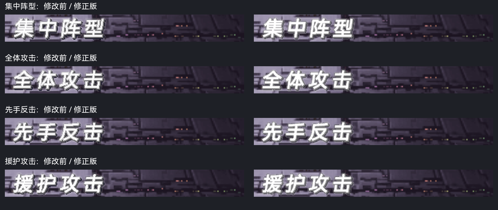
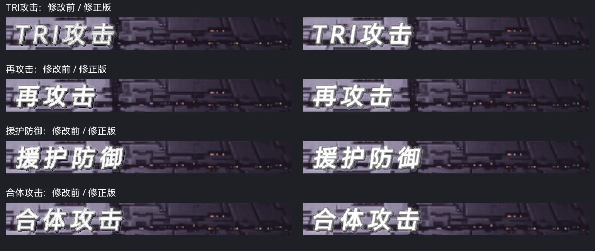

# SP 阵型／攻击标题原版风格修正

最终版本已冻结并写入主篇与 SP 当前镜像；下文哈希属于本次标题修订时的版本。最新身份见 [定稿与 ISO 写入记录](TRICMN_BATTLE_OVERLAYS_FREEZE_20261004.md)。

本次调整 TRICMN picture 0 的 12 条文字：TRI阵型、单体攻击、分散阵型、小队攻击、集中阵型、全体攻击、先手反击、援护攻击、TRI攻击、再攻击、援护防御、合体攻击。目标是接近原版的斜体白色笔画、暗侧边和柔和过渡。待机／原因提示和状态文字沿用各自已调整的材质。

## 原因与调整

原版标题显示路径使用运行时调色，颜色索引的明暗／混合关系不能直接从共享 CLUT 的静态预览推断。隔离镜像中的 16 色条探针显示，8、10、13、15 是较稳定的字面色阶；4、7、9、11、12、14 更受背景影响。探针记录的是混合后的屏幕 RGB，不能据此声称已经直接测出每个索引的 RGBA 或精确 alpha。

旧中文模式按硬亮边、字面内圈和侧面分别构造材料，静态预览虽可读，实际画面却显得多圈描边，中文的细笔画也让这些层更拥挤。新的 `native_title_soft_layers` 按覆盖率固定分配字面、侧边和过渡材料；完整覆盖的字面统一使用索引 15，字形的像素直方图不再改变笔画材料。

保留原来的字体、字号、8 度斜体、2×2 侧边偏移及文字区域；笔画扩展从 0.8 调整为 1.4，关闭额外的索引边缘滤波及硬亮边模式。所有效果在 8 倍矢量掩模上构造后缩小，不做截图级修补。

## 实际画面对照

集中阵型使用自身正常战斗事件。三行依次为原版日文、修改前、修正版；相同存档点、帧号和 LRPS2 软件渲染条件，局部以最近邻放大 2 倍。

以下每行左侧为修改前，右侧为修正版。全部 12 条按原索引像素、原尺寸放到集中阵型标题槽，检查相同的显示路径和调色。此方式验证字形／材质；除集中阵型外，不代表每条文字自身事件已经触发。

12 条均复看 frame 4657 与 4707，未观察到裁字或字面透底，笔画填色比修改前连续。37 像素高的文字区域在借用 36 像素高的槽位时只省略完全透明的末行，没有缩放文字。其余较矮区域的末行少量像素均为柔边材料。完整淡入淡出过程和 PCSX2 手工验收仍待完成。

## 构建与验证

- 28 项相关测试通过：`python3 -m unittest tests.test_tricmn_battle_overlays tests.test_special_disc_battle_status tests.test_psmt4`。
- 完整 51 条作者渲染与只替换 12 个冻结区域的候选成员字节一致；普通构建继续消费冻结索引快照。
- 主篇冻结成员与 SP 成员各修改 28,141 个纹素，全部位于这 12 个标题区域。其他 39 条文字、原版数字／HP／EN、CLUT、TIM2 头、其他图像和动画尾部均保持一致。
- 主篇冻结成员 SHA-256：`154981efcd67a3b4101206ac2ad5064e90656967d7e8f515ee4979836d698f99`。主篇 ISO 未重建。
- 当前 SP 成员 SHA-256：`12c29330f556e09467700e61bae3dcaee7dab7c1a88b31076947a8a10163de4a`，大小 677,456 字节，LBA 1,289,105。
- 当前 SP ISO：`build/iso/special-disc/sp-current.iso`，SHA-256 为 `a2ab8f6cf2f542ca13af3325eef23efef112c0e9c233ae9867e58a4c74219840`。
- ISO 目录、成员大小及 LBA 保持一致；整张镜像在 picture 0 的 65,536 字节图像区以外逐字节比较一致。图像区内部另按逻辑索引验证 12 个区域以外完全一致。
- 当前 ISO 回读与候选 SP 成员字节一致，并独立验证 12 个标题、10 个提示、10 个状态区域。当前 ISO 再次运行的集中阵型两张截图与候选截图像素一致；运行期间没有修改 RAM，源记忆卡 SHA-256 保持 `57c9cd6baee5499a3b374256351add3ad483b46717fa16b899680229c492fd21`。
- SP 后续全量构建已加入标题迁移和独立验证。本次当前镜像采用范围受限更新，继承之前的文本验证来源；没有重新运行旧构建目录不可用的 SP 全量文本验证。

复现入口：`tools/special_disc/writeback/refresh_battle_titles.py --evidence <新证据目录>`，重复执行已确认不产生第二次修改。作者、色条探针、区域保护与 ISO 回读证据位于 `work/analysis/sp-titles-original-adjust-20261004/`；逐项运行记录位于 `work/runtime/lrps2/sp-titles-original-adjust-20261004/`。
