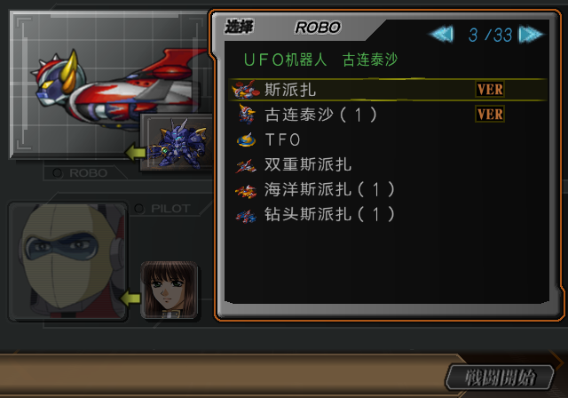
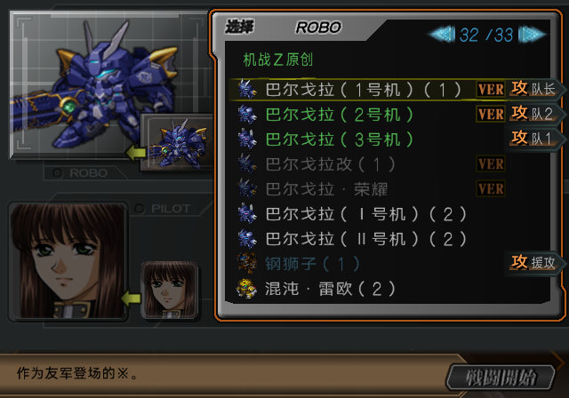
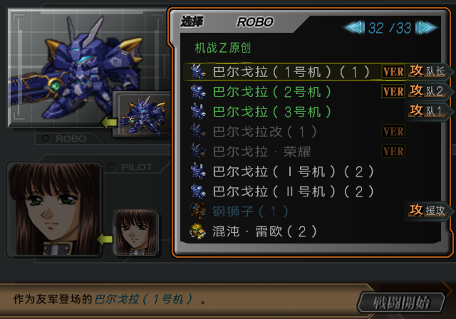
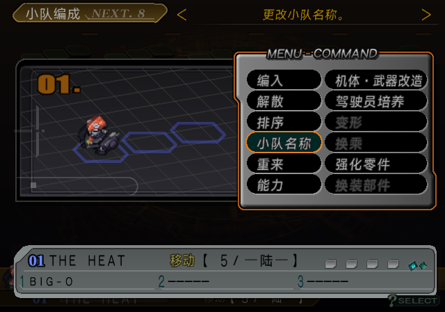
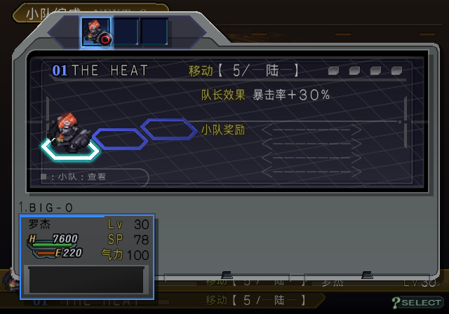
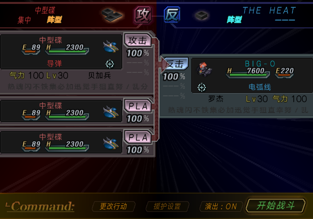

# SP 名称副本与战斗鉴赏名字替换：2026-10-06

用户报告最新 SP 的三项问题：飞天神机旧名仍存在；今天空格修复后兰德小队名只显示 THE；战斗鉴赏左下角名字显示为 ※。
附件仅作为玩家证据，未作为写入输入。本文记录实现、成品和运行证据，THE HEAT 原事件继续待验。

| 项目 | 本次结论 |
| --- | --- |
| 飞天神机残留 | 普通机体表已是斯派扎，但独立 Battle Viewer 列表两处和武器名三处仍沿用冻结迁移副本。本次五处同步现行审定语料，最终 ISO 回读与列表自然显示通过。 |
| 描述中的 ※ | 是原生名字替换标记 `81 A6`；写回错误地使用普通字形码 `96 56`。44 条说明恢复原生标记，最终 ISO 全量检查；ROBO 列表自然运行已显示当前机体名字。 |
| THE HEAT 只显示 THE | 当前资源及隔离探针中的关键词复制、编队、能力页、地图信息和战斗前指令栏均保留完整名字。沿用今天的测试场景，未复现兰德原事件；旧名缓存仍是假设，本项保持待复现。 |

## 旧名称的独立副本

以下均为解压 COMPDATA 的偏移；保留原始槽容量、所有指针和槽外字节。写入器同时接受原盘前像、已登记的旧汉化前像和本次目标像，其他前像拒绝。

| 偏移 | 旧译 | 现行译文来源 |
| --- | --- | --- |
| `0x98888` | 飞天神机 | `native-text.json#sd/compdata/83888` → 斯派扎 |
| `0x988E0` | 双重飞天神机 | `native-text.json#sd/compdata/838B0` → 双重斯派扎 |
| `0x7CDE0` | 双重飞天神机风暴 | `weapons.json#menu/Compdata/02/0034` → 双重斯派扎风暴 |
| `0x7CE00` | 海洋飞天神机风暴 | `weapons.json#menu/Compdata/02/0035` → 海洋斯派扎风暴 |
| `0x7CE20` | 钻头飞天神机风暴 | `weapons.json#menu/Compdata/02/0036` → 钻头斯派扎风暴 |

绑定契约：[shared-label-updates.json](../config/products/special-disc/shared-label-updates.json)。
生产写入：[shared_label_updates.py](../tools/special_disc/writeback/shared_label_updates.py)。
每次构建读取现行语料，并核对原文哈希、已审状态、引用集合、容量、压缩回读和最终 ISO。

## 名字替换标记

日文原句“味方として登場した※です。”中的 ※ 不是应显示的符号。
SP 原程序在 `0x414EA0` 附近调用字符串查找，目标是虚拟地址 `0x4C24F0` 的
`81 A6 00`，找到后复制前文、插入当前对象名字，再接上标记后的文字。
原生字节位于 ELF 文件偏移 `0x3C2E70`，最终 ISO 仍保留该原生常量。

共享字库把可见 ※ 分配到 `0x9656`。原写入器将这里的运行标记也当作普通文字编码，
两个字节版本通过项目回读表都能解码为 ※，所以单纯比较解码文本无法发现替换功能失效。

本次仅对 `sd/compdata/98730` 至 `sd/compdata/9E4E0` 范围内、日文原句本身含 ※ 的
44 条战斗鉴赏说明保留 `0x81A6`，检查原文和译文标记数一致；其他文字中的可见 ※
仍使用共享字形映射。独立 ISO 验证按实际编码单元核对原生标记，拒绝普通符号字形替代。

ROBO 列表实测从“作为友军登场的※。”变为“作为友军登场的巴尔戈拉（1号机）。”。
该画面按列表对象插入机体名字；PILOT 说明使用同类名字替换，静态覆盖已检查，未取得对应自然显示截图。

## THE HEAT 的本轮证据与剩余事项

最终 NISV 名称资源仍为完整的双字节字符串：
`82 73 82 67 82 64 81 40 82 67 82 64 82 60 82 73 00`。
本轮未修改 2026-10-06 的空格修复，也未缩写、删除空格或汉化英文名。

为单独检查八字符名字的关键词复制与显示，冷启动此前修复 SP，进入 NORMAL MISSION6，
组建 BIG-O 小队。探针仅将 NISV 中 The Big 的一个明确 28 字节名称槽换成上述 THE HEAT
字节，再经游戏自身的清空、关键词选择、确认和能力页操作。
实际小队字段 `0x616768` 保留完整 `THE　HEAT`，编队、能力页、地图信息栏和敌方回合的战斗前指令栏均完整显示。
战斗前指令截图右上角完整显示 THE HEAT，RAM 字段与完整字符串仍一致。
这是 RAM 探针，不能当作兰德原事件或玩家旧存档的自然验收。

旧存档可能已保存截断或旧编码的名字，更换 ISO 不会重新生成这个字段；目前只列为待核假设。
用户提醒今天已经走过小队名测试，本轮已复用该 NORMAL MISSION6 路线并补齐八字符名字的战斗前指令栏探针。
本轮探针未复现截断，不能确定玩家报告发生在哪个已保存字段；不据此关闭追报，也不自动改写玩家名称或存档。

## 制品与验证

- 当前 SP：[sp-current.iso](../build/iso/special-disc/sp-current.iso)
- SHA-256：`b8b9cc01b9539be0a62a457c7177f0fdb14eff91589ff9efd3eb90d678ee27d1`
- 大小：3,791,781,888 字节。
- SP 专项 165 项、完整测试集 747 项通过。
- 构建完成后才提升 current；最终独立回读确认 44 个名字替换标记、5 个新增名称副本。
- 自然运行的候选与最终 current 完整哈希一致；冷启动、Software (SW)、禁用 cheats，名称／描述验收未注入 RAM、未跨 ISO 即时存档。
- THE HEAT 探针单独记录 RAM 修改，不能与上述自然运行混为一项。
- 本次未进行 PCSX2／人工验收。THE HEAT 原战斗场景和玩家旧存档待验。

证据：[收据](issue-assets/sp-three-issues-20261006/receipt.json)、
[THE HEAT 探针输入](issue-assets/sp-three-issues-20261006/heat-probe-input.json)、
[完整测试日志](issue-assets/sp-three-issues-20261006/full-tests.log)、
[SP 专项日志](issue-assets/sp-three-issues-20261006/sp-tests.log)。

后续用户指出本轮 `pilot-option-after.png` 的丹泽尔仍为日文。
已另行修复 58 个驾驶员选择短名槽并生成更新制品；上文哈希保留为本轮历史证据。
后续 current 哈希与验证见 [PILOT 选择短名修复](SP_PILOT_VIEWER_LABELS_20261006.md)。
