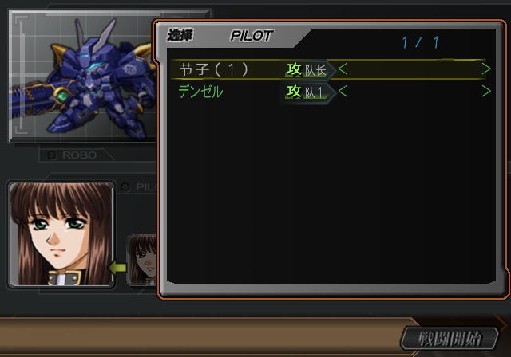
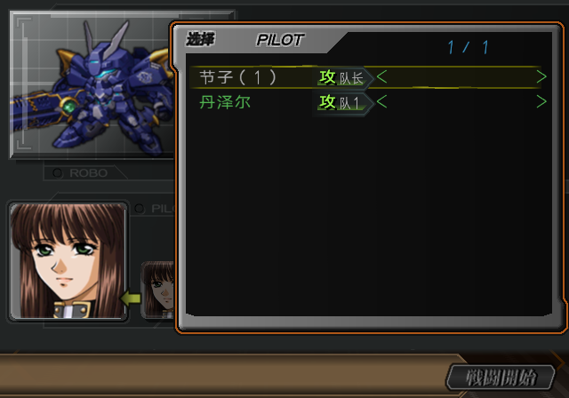

# SP 战斗鉴赏 PILOT 选择短名遗漏：2026-10-06

用户指出上一轮 `pilot-option-after.png` 中仍显示日文“デンゼル”。
该截图本身确实包含遗漏；上一轮只确认 ROBO 名字替换，没有检查这个 PILOT 选择窗口的全部名字。
截图仅作为问题证据，不作为写入输入。

## 所属资源与覆盖范围

普通驾驶员表的 display/family/given 字段已经汉化。
这个窗口读取另一张 48 字节记录表（解压 COMPDATA `0x71200` 起，554 行），
名字指针在记录内 `+4`。它不在既有 969 人驾驶员主表检查范围内。

本轮逐行扫描这张选择表，得到 523 个独立名字目标，其中 58 个短名槽、60 行仍有假名。
“デンゼル”位于 `0x9E5F0`，指针引用在 `0x76454`。
同一类遗漏包括托比、艾岱尔、极·艾岱尔，以及其他作品驾驶员的独立短名。

所有 58 个短名都能在既有审定的
`config/products/special-disc/shared-name-reference.json#pilots` 中唯一绑定。
本轮将这些既有译名纳入 native corpus，登记原盘字节、已有汉化前像、槽容量和准确引用集合，
通过上一轮的共享标签写入器写入。没有重新拟定这些名字的译法。

## 写入边界

58 个名字全部按原槽容量写入；原有指针、非名称数据和槽外字节保留。
归档解压大小、压缩成员预算和 ISO 扇区布局保留。

第一次扫描按原盘指针读取名字，将已不使用的 `ダヴ` 原槽也计入了遗漏。
构建引用检查拒绝这项绑定后，改为逐行读取当前成品的实际名字指针。
`Dove` 已通过既有尾串共享重定向（`0x74D44 → 0x9CDB6`）汉化，
本轮保留该指针和英文名，纠正计数为 58 个短名槽、60 行。

最终验证除检查这 58 个槽外，还扫描全部 554 行选择名字，拒绝假名、未知码、空名字，
并核对记录身份及指针集合，防止普通主表验收掩盖选择表遗漏。

## 验证证据

原始扫描、构建和运行证据保存在 `docs/issue-assets/sp-pilot-residue-20261006/`。
完整测试集 749 项通过。候选 ISO 冷启动至用户指出的同一选择窗口，
第二行已完整显示“丹泽尔”；Software (SW)，禁用 cheats，未注入 RAM、未载入即时存档。
最终 SP current 完整哈希为 `bcdb74f5da5525721e5bd147562cb56148ebed1e7c97c4f8c285cf1b8df03f25`，
最终 current 与冷启动运行的候选哈希一致。
独立 ISO 回读检查通过 63 个共享标签（上一轮 5 个、本轮 58 个），
以及 554 行驾驶员选择名字；假名残留为零。
本轮未进行 PCSX2 人工验收。

当前制品：[sp-current.iso](../build/iso/special-disc/sp-current.iso)。
[验证收据](issue-assets/sp-pilot-residue-20261006/receipt.json)，
[独立回读](issue-assets/sp-pilot-residue-20261006/independent-readback.json)，
[全量测试日志](issue-assets/sp-pilot-residue-20261006/full-tests.log)。

