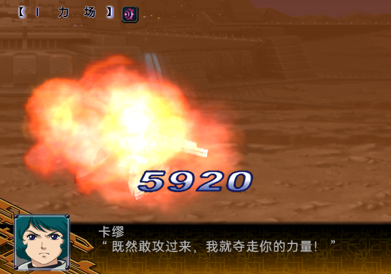
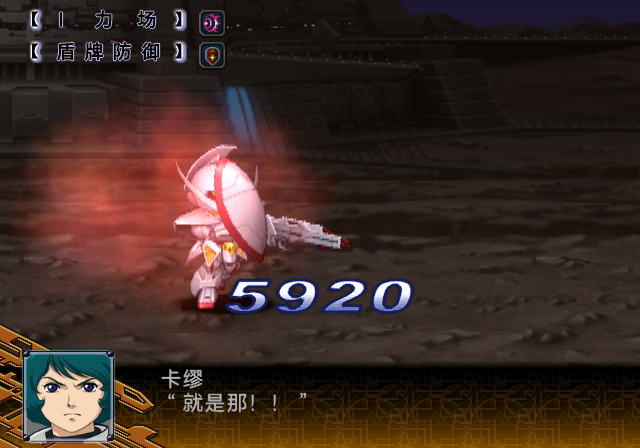
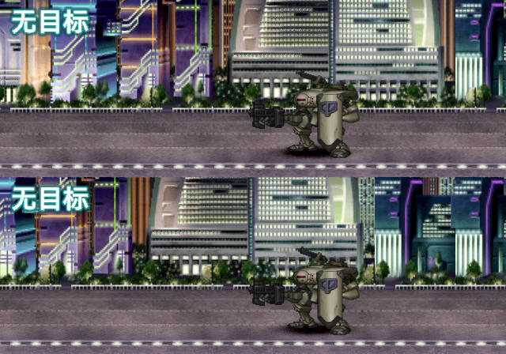
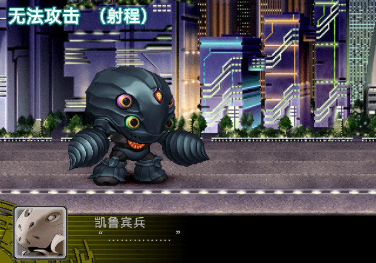
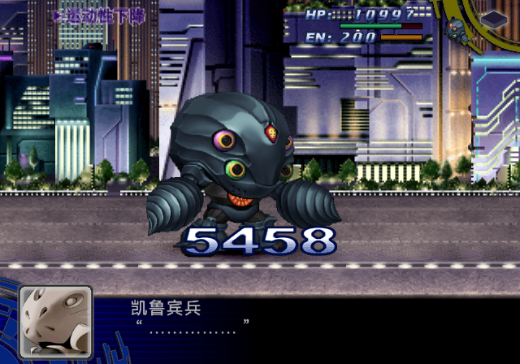

# TRICMN 战斗文字定稿与三个 current ISO 写入

2026-10-04 用户确认全部文字冻结并写入 Original、BEST、SP 三个 current ISO。本次补齐先前仍留在实验目录的 19 条能力／防御修正版；状态／抵抗 10 条、阵型／攻击标题 12 条、EN 风格提示／原因 10 条保持上一轮定稿像素，合计 **51 条**。

能力文字采用已逐项借用 I 力场槽检查的候选：19px HarmonyOS Sans SC，8 倍矢量覆盖，连续黑色字芯和灰阶过渡，白色反光边。运行色条确认的索引角色决定覆盖映射，避免按数值顺序或直方图把半透明、亮边散布到笔画内部。当前作者渲染与候选 19 个文字矩形逐像素一致。

主篇与 SP 的原生括号像素不同，因此仅迁移文字矩形。未把 SP 整张 picture 2 复制到主篇，也未把主篇整张图复制到 SP。括号、CLUT、TIM2 头、其他图片、动画及尾部保持各版本原有字节。

普通构建继续消费 `locked_indexed_snapshot`，不读取字体或重新栅格化。快照为 `reviewed_locked`／`explicit_refreeze_only`。SP 全量构建与独立验证器现在覆盖四组全部 51 条，包含新增的 `battle_ability_labels` 19 条。

## 冻结身份

| 文件 | SHA-256 |
| --- | --- |
| 冻结索引快照 | `d2e151af82c3c5c6d545a855f3db7ee8ffc8b8b1e92d41d62db9a987977a5213` |
| 主篇 `BTL/TRICMN.BIN`，677,424 字节 | `b4e46757798ed19150d8817fe26a7425f819e3fff541fd5896b7b51e4ec1a092` |
| SP `BTL/TRICMN.BIN`，677,456 字节 | `3dd1a6e66bb498b5cbf3ae96ab81509d066bedd132a441a20d4d0e769c898076` |

## 当前 ISO

| 版本 | 路径 | SHA-256 |
| --- | --- | --- |
| Original | `build/iso/zh-release-original/current-original.iso` | `c6bc48d3c230216b7f2f6616d5708e0c4ae55d2fda85654b7404353b4b931e4f` |
| BEST | `build/iso/zh-release-best/current-best.iso` | `bb39e762c6057d83d5f1b839c6e72f4c2879c90ddb312e9c9eb4f942928f14c6` |
| SP | `build/iso/special-disc/sp-current.iso` | `98b33f9d5f7e201fd17783dad68002b5956a1f996f424625df032ba13bae9f3b` |

保留三个统一 current 入口，默认方块 skip 已核对；不发布 daily-test 或其他 current 副本。以上是本次写入时的身份，后续文本构建可能改变整盘哈希。最新身份以各版本 current 收据为准。

## 写入与回读

本次在已有且已验证的三个文本镜像上，仅更新成员内 picture 2 的 `[355584,421120)` 图像区。每版实际改变 32,231 个逻辑像素，变化只落在 19 个能力文字矩形。另 32 个文字单元逐项回读与冻结快照一致。

写入前后全盘逐字节比较保护区；Original 的 3,758,292,992 字节、BEST 的 3,755,016,192 字节、SP 的 3,791,716,352 字节均保持一致。成员目录、大小、LBA 均未改变，ISO9660 成员回读和独立 7z UDF 成员回读一致。既有文本语义验证通过保护区字节一致继承，本次没有从其他未提交语料重建文本。

三版 current 收据、继承的语义回读和新增资源回读均已重新绑定整盘哈希，统一版本收据验证通过。根目录组件合同仅刷新 TRICMN 相关锁；已退役的独立主篇构建输出锁按同一资源差异计算，没有重建第四张 ISO。

证据位于 `work/analysis/tricmn-ability-freeze-20261004/`：

- `authoring.json`：正式作者渲染合同；19 条与已审候选一致，其他像素保护检查。
- `original-production-readback.json`、`best-production-readback.json`、`sp-production-readback.json`：全盘范围保护、51 条逐项回读、UDF、成员大小和 LBA。
- `three-current-verification.json`：三版收据完整性验证。
- `tests.log`：30 项相关测试通过，含 SP 能力组迁移、幂等性、越界保护及损坏单元拒绝。

正常冻结组件复现：

```sh
python3 tools/build_tricmn_battle_overlays.py --force
```

## 更新后 SP 的运行复测

直接运行上表的 `sp-current.iso`，在简易战斗鉴赏以 Z 高达／卡缪／光束步枪攻击 Turn A／罗兰。使用进入战斗前的 checkpoint，以正常按键进入战斗；没有 RAM 修改或能力调用替换。

帧 5225 自然显示新 I 力场；第二场选择防御后，帧 7545 同时自然显示新 I 力场和盾牌防御，帧 7575 保存暗背景画面。文字笔画连续，字芯透底和碎亮边较旧正式版改善。





运行证据为 LRPS2 Software (SW)，位于 `work/runtime/lrps2/tricmn-ability-freeze-20261004/runs/production/51-frozen-labels/receipt.json`。其余 17 条保留此前统一 I 力场槽的文字显示夹具证据，不宣称全部自然触发。源记忆卡保持不变；PCSX2 手工验收及完整淡入淡出检查仍 pending。

## 前次主篇运行证据

使用之前都市关卡第 2 回合 Continue 的私有记忆卡副本，王者盖纳以“超限冻弹”攻击凯鲁宾兵，选择分散阵型并打开完整演出。没有修改 RAM、程序或运行事件。

帧 6104 自然显示“无目标”，帧 7544 自然显示“无法攻击（射程）”；可见补光晕后的本身槽位提示。





同一场战斗在帧 7304 自然触发新冻结的“运动性下降”，补充了状态组一条自然事件证据。其他状态文字仍保留原有诊断注入／借槽证据的边界，不能据此认为 10 种状态都已自然触发。



运行证据为 LRPS2 Software (SW)。源记忆卡 SHA-256 保持 `8880c03560fa0d436d005d8c9dde199239820a03c5106eecdb273186fcaabff0`，记录在 `work/runtime/lrps2/tricmn-freeze-20261004/production-native/receipt.json`。PCSX2 手工验收及完整淡入淡出检查仍待补。

前序修订与画面对照：[状态文字](SP_BATTLE_STATUS_TEXTURE_20261004.md)、[阵型／攻击标题](SP_BATTLE_TITLES_TEXTURE_20261004.md)、[提示文字与 EN 光晕](SP_BATTLE_PROMPTS_TEXTURE_20261004.md)。上述记录内旧 ISO 哈希属于各次历史修订，本次定稿身份以上表为准。
