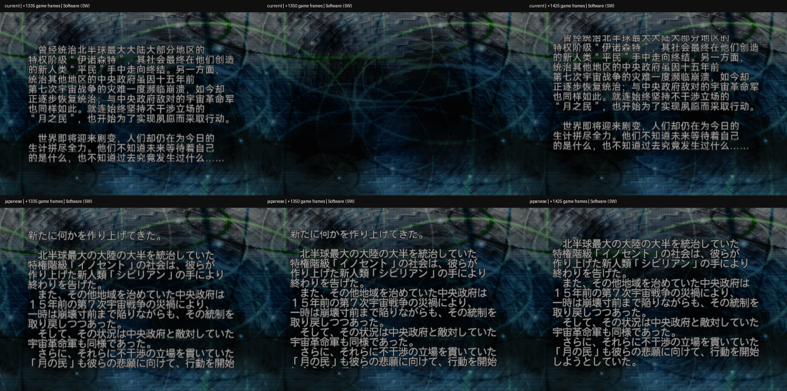
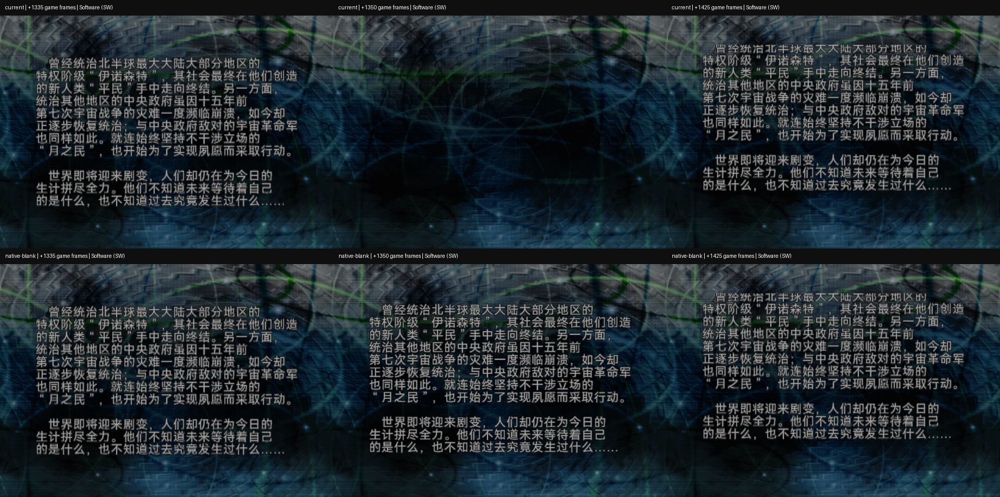

# 开场世界观滚动正文整块文字短暂消失（2026-10-02）

版本归属：[v0.4.2 发布后问题台账](V0.4.2_POST_RELEASE_ISSUES.md)。

状态：**根因已通过单项实验确认；本篇与 SP 的源占位符修复及构建检查已完成；Best 独立候选与 SP 文本组件通过静态检查，生产 current ISO 未替换。**

用户视频中的第二段世界观正文在滚动中整块消失，背景持续显示，之后正文恢复。
用户回忆录像约使用 2026-09-22 的 `current-best-skip`。录像对应的模拟器信息为
Java `15210 v1.5-4248 release`，Native `AetherSX2 v1.5-4248-g3a6307d69`，
构建时间 `Mar 13 2023 11:07:01`。该旧镜像没有取得哈希，不把它绑定到某个发布版。

用户随后要求使用当前 Best，确认连接的 Seeker 上问题一致，并补充本机 Armsx2 也有同样问题。
收到“不要手机任何测试了”后停止全部手机操作；后续复现只在本地进行。

## 原录像逐帧定位

录像视频流：854×384，25 fps，673 个解码帧，约 26.92 秒。
帧号从 0 开始；这里是**录像帧号**，不是 PS2 游戏帧号。

| 段落 | 首个无字录像帧 | 最后无字录像帧 | 首个恢复帧 | 无字时间区间 | 持续时间 |
| --- | ---: | ---: | ---: | --- | ---: |
| 第一次 | 330 | 360 | 361 | `[13.20, 14.44)` 秒 | 1.24 秒／31 个录像帧 |
| 第二次 | 601 | 629 | 630 | `[24.04, 25.20)` 秒 | 1.16 秒／29 个录像帧 |

不是单字缺失或一帧换页。两次均为整块正文消失，背景仍在；恢复后继续原有滚动。
视频经过云转码，因此帧数不能作为 PS2 内部缺帧数；时间和可见现象可作为录像证据。

- [原始用户视频](issue-assets/world-history-text-dropout-20261002/user-report.mp4)
- [消失／恢复边界截图](issue-assets/world-history-text-dropout-20261002/dropout-boundaries.png)
- [视频帧与时间分析](issue-assets/world-history-text-dropout-20261002/video-analysis.json)

## 当前镜像与已确认运行证据

本轮使用 `build/iso/daily-test/current-best-skip.iso`，与
`build/iso/zh-release-best/current-best.iso` 的构建收据一致，大小 3,755,081,728 字节。
SHA-256：`38fc5a7c1097aa91512cfc276b1a48956be4b49f69ff06b007708969b6c39f11`。
手机端传入新文件后的完整 SHA-256 与本地一致；旧手机镜像未覆盖。

| 环境 | 证据 | 结果 |
| --- | --- | --- |
| 反馈录像：AetherSX2 1.5-4248，旧 current-best-skip 身份未知 | 原始 MP4 | 两次整块消失 |
| Seeker／Android 16／AetherSX2 1.5-3668／OpenGL／1×／Basic blending／Full texture preloading | 同哈希 current Best；用户目测确认＋截取录屏 | 截取录屏约 `[9.475, 10.658333)` 秒无字，约 1.18 秒 |
| 用户本机 Armsx2 | 用户明确反馈 | 同样现象；本轮没有该宿主的录像 |
| 本地 LRPS2／Software (SW)／当前中文 Best | 同一输入序列，221 张截图，每 15 个游戏帧一张 | 两次整块消失 |
| 本地 LRPS2／Software (SW)／日版 Best 原盘 | 同一核心、输入序列、隔离复制的同一记忆卡，221 张截图 | 正文可见期间未出现整块消失 |

本地扫描从输入序列游戏帧 3021 开始，再推进 3300 个游戏帧。
中文的两段无字样本是相对帧 `1350–1410` 和 `1995–2055`；
前后可见样本分别为 `1335/1425` 和 `1980/2070`。
15 帧取样限制了精确边界判断，但足以捕获本问题约 1.2 秒的空白。
初始文字尚未入场及字幕正常离场后的空白不计为故障。

**完整扫描修正了早期稀疏截图的判断：软件渲染也会复现，不能归因于硬件后端。**

- [手机游戏画面截取](issue-assets/world-history-text-dropout-20261002/phone-scroll-opengl-excerpt.mp4)
- [软件渲染扫描数据](issue-assets/world-history-text-dropout-20261002/software-scan.json)
- [镜像、核心、记忆卡和人工证据收据](issue-assets/world-history-text-dropout-20261002/runtime.json)

## 静态所有者与排查范围

目标为 `DATA/MTV_PROS.BIN`，decoded chunk 1 的 `summary/01/000`，
开头“这是一个地球早已失去往昔文明与自然环境……”。
不能把它当作 STAGE 对话框、战斗字幕或 VT1 标题纹理问题处理。

| 项目 | `summary/00/000` | `summary/01/000` |
| --- | ---: | ---: |
| 当前中文物理行数 | 35 | 17 |
| 日文原文物理行数 | 46 | 24 |
| 固定文本容量 | 1489 字节 | 809 字节 |
| 当前未知编码数 | 0 | 0 |
| decoded chunk 大小与日版一致 | 是 | 是 |
| 文本容量区以外的全部字节与日版一致 | 是 | 是 |
| 文本记录头与日版一致 | 是 | 是 |

[原盘／当前镜像静态回读](issue-assets/world-history-text-dropout-20261002/summary-readback.json)。

静态结果排除了这两条资源中未知编码、越界扩容和直接改写非文本记录的解释。
它不证明 CPU／GS 实际绘制参数正确，也不排除其他汉化组件对绘制路径的影响。
中文／日版在同一软件核心中的差异将调查集中到汉化输入及其绘制过程；
完整 ISO A/B 同时包含字体、程序和其他组件差异，不能据此宣布某一个字符串或函数就是根因。

## 单项实验确认根因

原盘全部 28 条 MTV_PROS 正文共有 14 个段落分隔行，全部含 U+3000 全角空格；
不存在零长度行。中文稿在 4 条正文中将这 14 行变成真正的空行。
原盘分隔符是 `0A 81 40 0A`，有问题的中文分隔符是 `0A 0A`。
换行控制字节为单字节 `0A`，全角空格占位符为双字节 `81 40`。

| 同一当前 Best 程序／字体下的单项实验 | 结果 |
| --- | --- |
| 中文正文末尾补 7 个空行，使行数由 17 变成 24 | 两个原失字帧段仍整块无字，排除仅由总行数变短触发的解释 |
| 只把 `summary/01/000` 的两个空段落分隔行改为 U+3000 | 原失字帧段持续显示文字；161 张截图、每 15 个游戏帧一张，覆盖 2400 个游戏帧，正文可见期间没有再次整块无字 |

有效实验保留正文内容、物理行数、程序、字体、所有记录头与滚动参数。
因此本次可确认的触发输入是**完全空的段落分隔行**，修复是恢复原生全角空格占位符。
具体绘制函数怎样处理该边界尚未追踪到指令级；不把这一输入层面的因果验证扩写为 GS 或模拟器内部缺陷。

- [原盘 28 条正文的分隔行审计](issue-assets/world-history-text-dropout-20261002/native-blank-row-audit.json)
- [行数实验与占位符实验结果](issue-assets/world-history-text-dropout-20261002/diagnostic-results.json)
- [单项占位符候选构建证明](issue-assets/world-history-text-dropout-20261002/blank-row-diagnostic-build.json)

早期错误编码的补行试件未通过静态回读前置条件，已作废；上述行数实验只指成功回读为 24 行的有效试件。

## 源修复、候选与验证边界

- `corpus/zh/summary.json`：修复 `summary/00/000`、`summary/01/000`、
  `summary/05/000`、`summary/07/000` 共 14 个分隔行；可见文字及物理行数保持。
- `tools/srwz/chinese_prose.py`：`world_history_scroll` 排版保留 U+3000 分隔行，
  避免下一次重排重新生成零长度行；其他排版 profile 保持原行为。
- `tests/test_balanced_prose.py`：新增原生分隔符字节、重排占位符及完整语料分隔行回归检查。
- `config/full-story-components.json`：仅刷新 `world_history.corpus` 的大小与哈希；
  保留此前其他功能的配置改动。此前该字段已与当前源码哈希不一致，前值保存在源修复收据。

[源修复收据](issue-assets/world-history-text-dropout-20261002/source-fix.json)。

验证：`test_balanced_prose` 12 项、`test_renderer_width_layout` 21 项、
`test_release_workflow` 30 项，共 **63 项通过**，另通过 Python 编译检查及 `git diff --check`。

已生成独立的本地 Best 修复候选：
`work/feedback/aethersx2-text-dropout-20261002/current-best-blank-row-fix.iso`。
SHA-256：`d03f66ab8540fad39b3915143d1271bd7ad04e35288a0491b93223efd30dd192`。
大小与原 current 相同，全部字节比较确认变化仅位于四个 MTV_PROS 压缩块；
程序、字体、归档偏移、记录头和滚动参数保持。
候选的 decoded chunk 1 与已通过本地运行对照的单项试件完全相同。
[完整候选的静态校验收据](issue-assets/world-history-text-dropout-20261002/full-candidate.json)。

本地软件渲染证明第二段开场正文的单项修复。第一段及其他两条同结构正文已做静态修复，
其目标流程运行验收仍单独待办。本轮未再次操作手机，也没有把此前 Armsx2 对原候选的反馈
当作修复后验收。生产 `current-best` 尚未替换，没有 commit、push 或发布。

## 引入历史与扩展范围审计

2026-10-02 根据后续问题追查 Git 各版本正文，并直接回读上述构建收据中的
Original、Best、SP 三份生产 current 镜像。完整记录为
[历史与成品范围审计](issue-assets/world-history-text-dropout-20261002/history-scope.json)。
日期均为 UTC+08:00。历史结论来自版本数据和构建代码，未运行历史镜像。

| 时间／提交 | 变化 | 证据边界 |
| --- | --- | --- |
| 2026-07-27 23:00:27，`f1f72b3` | 本篇最初翻译稿的 4 条正文已有 14 个零长度分隔行 | 早期源稿，不据此声称某个当时发布镜像出现失字 |
| 2026-07-28 11:45:14，`90506ff` | 将这 14 行全部恢复为全角空格占位行 | 此后所有修改 summary 的提交直到 9 月 13 日均保留占位符 |
| 2026-09-28 16:54:04，`e7f88dc` | 引入 `reflow_chinese_prose`，把仅含空格的行归为 `None`，再输出空字符串 | 排版函数产生回归的代码起点；此提交尚未改写 summary 语料 |
| 2026-09-28 23:24:59，`1a73100` | 批量写回正文，将四条 summary 的 14 个占位行全部改为零长度行 | 当前本篇语料回归的实际写入提交 |

因此当前本篇的问题是在 **9 月 28 日重新引入**。用户回忆录像镜像约为 9 月 22 日，
但原录像镜像无哈希或可靠构建身份；不能将那份旧镜像强行归到 9 月 28 日提交，
也不能用此源码追溯宣布它的失字原因已完成历史版本验证。

本篇 Original 与 Best 共用 `corpus/zh/summary.json`。
直接回读两份当前成品，各自全部 28 条 MTV_PROS 正文中，以下四条含完全空行；
其余 24 条未发现该输入缺陷。

| 记录 | 内容识别 | 缺失占位符数 |
| --- | --- | ---: |
| `summary/00/000` | 开头“这是一个被称为宇宙世纪的时代” | 4 |
| `summary/01/000` | 开头“这是一个地球早已失去往昔文明与自然环境” | 2 |
| `summary/05/000` | 开头“凭借埃曼人的活跃”，叙述 UN、多元世界与相克界 | 4 |
| `summary/07/000` | 开头“新的世界，孕育出新的战争” | 4 |

这是两种本篇版本都已进入成品的资源缺陷；运行因果实验仅覆盖 Best 的 `summary/01/000`。
不能将另外三条或 Original 的静态缺陷直接写成已逐条复现同样的消失现象。

**新发现：SP 的 `DATA/MTZSPROS.BIN` 也有占位符缺失，当前候选尚未覆盖。**
SP 全部 10 条叙述中，`narration/000`（2 行）、`001`（1 行）、`002`（1 行）、
`003`（2 行）、`008`（1 行）、`009`（1 行），共 6 条、8 个分隔行，
原文含全角空格，当前语料与成品均为零长度行。
SP 的 ISO 回读解析器使用 `summary/NN/000` 形式的 ID，对应语料 `narration/NNN`；
本报告对外使用语料 ID。

SP 的引入时间分两层：

- 2026-09-20 10:47:17，`a2d1eed` 的早期写回函数 `paragraphs()` 已把仅含空格的行输出为
  `''`，且 `Writer.narration()` 在编码前调用它。因此即使当时语料仍保留占位符，构建路径
  已会丢掉它。这是可定位的 SP 写回代码起点，未回读或运行当时的历史镜像。
- 2026-09-28 的 `1a73100` 又把上述 8 行直接从 SP 语料中删除。
  当前 SP 成品回读确认全部 8 行仍缺失。SP 运行中的整块失字尚未复现验证，当前标记为
  同类输入缺陷与待验证运行风险。

其他语料中的完全空行集中在 SP 固定页、Q&A 等流；它们不是 MTV_PROS／MTZSPROS
滚动正文，不能仅凭空行将它们判为同一故障。本篇流程梗概、图鉴及剧情对白语料的扫描
未发现正文内部零长度行；这不是对这些界面全部运行行为的验收。

当时漏检的原因是验证关注可见文字、行宽、行数与控制标签；
`logical_prose_text()` 比较前会去掉行首空格并连接所有行，因此
“含全角空格的分隔行”和“完全空行”得到相同结果。空行数也未变化，
这些检查无法发现丢失 `0x8140` 的问题。此前运行取样只验证行宽，没有覆盖整段滚动。

本篇四条的源修复与独立候选仍有效；此前修复条件仅匹配 `world_history_scroll`，
**该次审计结束时 SP 六条及其 `sp_narration_scroll` 排版路径尚未修复；后续补修见下一节**。该次扩展审计只新增证据和报告，
没有替换生产 ISO、操作手机或进行提交／发布。

## 后续占位符修复与构建检查

用户随后要求继续查找丢失的占位符并加入检查。本轮扫描 233 个中文语料 JSON 文件，
对其中 11,733 条带 `source_text` 的记录比较空白占位行，并从原盘读取本篇 28 条及 SP
10 条滚动正文，检查全部原文哈希绑定与记录清单。

额外发现 SP 审阅源 `reviewed-non-stage-text.json` 的 `corpus/narration/001` 将原版
整行 21 个全角空格缩为 1 个；并非完全删空，但原生空格长度已丢失。
已恢复该审阅源，以及当前 `frame-text.json` 的全部 6 条叙述、8 个占位行。
其中这一行恢复为 21 个 U+3000，其余七行各一个，合计 28 个原生空格。
可见正文、物理行数与其他译文不变，`submitted_translation` 保留历史投稿内容。
修复后全量带原文记录中未再发现占位行数量／长度差异。

这项扫描不是对所有资源的原盘字节审计：其他只存源哈希的语料没有借此自动验收。
固定页/Q&A 的零长度行仍按各自文本格语义处理；VT1 写回会给整行补 `0x8140`，
其用于比较的 `rstrip('　')` 不代表存储空格被删除。

实现的检查路径：

- `srwz.summary.validate_scroll_placeholders()` 独立检查空白行必须含 U+3000，
  并与原盘保持分隔行顺序、数量和每行空格长度；允许正文重排改变物理行位置。
  编码检查要求占位行仍由 `81 40` 字节构成。
- 本篇组件构建和 SP narration 写回先检查原始语料；共享 summary 写入器在生成补丁前
  同时检查文本与编码。删掉整个分隔行、缩短多空格行和改变空格编码也会阻断写回。
- `reflow_chinese_prose()` 保留原有占位行；本篇和 SP 滚动 profile 都保留可绘制占位符，
  并在重排后再核对。固定段落函数 `paragraphs()` 同样保留已经存在的空格行。
- 本篇与 SP 成品验证器对照原盘检查回读正文与占位字节，避免“坏语料与坏成品相同”通过验收。
- SP 审阅稿导入路径拒绝修改叙述占位行。新增命令
  `python3 tools/text_layout/audit_scroll_placeholders.py` 提供语料全量检查；发现差异返回非零状态。

- [语料审计结果](issue-assets/world-history-text-dropout-20261002/placeholder-guard-audit.json)
- [已知坏成品拦截与修复组件回读](issue-assets/world-history-text-dropout-20261002/placeholder-guard-readback.json)

验证结果：完整测试集 671 项通过；随后新增的审阅源检查和正文测试共 15 项补跑通过，
占位符写回／错误编码／删除整行／缩短长占位行的 6 项测试也通过。
Python 编译检查与 `git diff --check` 通过。

SP 使用正常生产 frame 写回器生成隔离文本组件
`work/feedback/aethersx2-text-dropout-20261002/sp-frame-placeholder-fix/`，
全部六类文本表面构建通过，并独立解压回读所有 10 条 MTZSPROS 正文，核对原盘占位长度及 `8140`。
MTZSPROS 输出 SHA-256 为 `f1c0baeda8c64b07f48cde41d1563bf01061bf8c284fb0430630f24337cf8a6b`。
新的检查拒绝未修复的生产 Original／Best 各 4 条、SP 6 条；此前 Best 修复候选全部 28 条通过。

生产三版 current ISO 均未替换，未生成本轮 SP 完整 ISO，未做 SP 运行验收；
没有手机操作、commit、push 或发布。此前 Best 的单项运行证据不扩展为 SP 运行验收。

## 2026-10-02 生产构建、提交和问题登记

GitHub issue：[#29](https://github.com/dyzz/srwz-zh/issues/29)，反馈者为 **黑泽小皮**。根因、引入历史、影响范围和后续检查均已登记。Issue 保持开放，等待新生产镜像运行验收。

修复源提交 `111a8c992513af7843fdfb03c7bd6b483453b26f`；构建记录提交 `ed67a2cb59ba6eb9a7a88c405a015ee44f226553`。两笔均已推送 origin/main，并核对远端 HEAD。

完整测试 671 项通过；精确归档尺寸锁更新后的 release workflow 30 项通过。三版正常生产构建、完整成品回读、批次校验通过；额外原盘对照成品中的占位行数量、长度和 `8140`：Original/Best 各 28 条记录、14 个占位行；SP 10 条记录、8 个占位行、28 个 U+3000。

| ISO | SHA-256 |
| --- | --- |
| `build/iso/zh-release-original/current-original.iso` | `c8886012c368d1b9aab1d7cda2a3cead4705a0b28ec4ca9389b5e1426989c5c4` |
| `build/iso/zh-release-best/current-best.iso` | `a2e08f3c4434eb0bf5725feb246cb7c34bf3cb7806d71af92ecd9f85581355de` |
| `build/iso/special-disc/sp-current.iso` | `f24e1fc40a0519d074b76bb18557fc5e546208fd080fef6aec3918937244724f` |

批次 `manifests/editions/scroll-placeholders-20261002.json`；专项验证 `manifests/editions/scroll-placeholders-20261002-validation.json`。新 Best 的目标第二段解码块与前述 LRPS2 修复试件完全一致，但不能据此把新生产镜像整体标为运行通过。三版新生产 ISO 的 runtime 仍为 not_tested；SP 的运行失字尚未验证。没有继续手机测试。

原有未提交工作已恢复；79 个非本次修复文件逐一 SHA-256 一致，组件配置中的非 world_history 字段也与构建前完全一致。本次提交仅包含修复源、精确锁及生产构建验证记录，ISO 留在本机。

## 2026-10-02 新生产 ISO 的本地 LRPS2 验收

用户确认本问题用本地 LRPS2 即可验收。新生产 Original／Best 的 `summary/01/000`
均从冷启动、正常输入进入，连续采样 221 张（15 游戏帧间隔）。正文可见窗口相对帧
120–2310，内部空白样本为 0；原来两次失字区间均有文字，随后正常离场。

SP 首次导航停在数据链接菜单，第二次停在奖励页面，两轮均未获得正文验收。
最终通过数据链接及资金／BS／PP／零件奖励确认后，实际进入 `narration/000`。
正文可见窗口相对帧 315–2940，221 张采样中正文内部空白为 0，之后正常进入场景。
初始蓝色背景亮化产生亮像素，不能当作正文出现；相对帧 0–300 是入场背景效果，
人工核对截图后单独排除。没有通过修改文本或 RAM、载入旧试件存档来替代新 ISO 验收。

核心为 LRPS2 v2.0.0-16e520b、Software (SW)。三版实际 ISO 哈希均与构建记录一致；
原始记忆卡 SHA-256 前后不变，只使用隔离复制。没有继续手机测试。
新运行收据 `manifests/editions/scroll-placeholders-20261002-lrps2.json`；
原始截图和输入命令位于 `work/feedback/aethersx2-text-dropout-20261002/production-lrps2/`。
其他已修复记录的占位行已全部原盘字节核对，本次没有逐条运行遍历；验证范围不扩展为整部游戏运行通过。

## 2026-10-02 三版独立 CHD

已将上述同哈希生产 ISO 制成独立 CHD，zlib / 16384 字节 hunk，不依赖父盘。三份均通过 chdman verify，并完整解压回 ISO 核对大小与 SHA-256 一致。成品位于 `build/chd/20261002-scroll-placeholders/`；收据 `manifests/editions/scroll-placeholders-20261002-chd.json`。本轮未上传百度网盘，浏览器访问被安全策略阻止。
