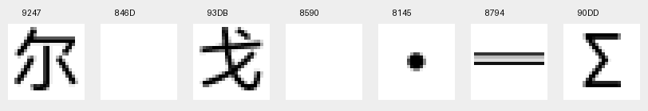

# SP 机体与机师名称遗漏排查（2026-09-29）

后续已完成 [SP 剩余旧编码入口修复](ENCODING_ALIGNMENT_20260929.md)，并发布 SHA-256 为 `2afa98bb0e64db3c1a0467e2a16e99f274c33c3f260cb0d378bf0342ebec1744` 的当前镜像。后续改动仅涉及地形和武器效果，下面记录的机体／机师修复及全表验收结果保持有效。

## 修复与全表验收更新

用户随后授权按本篇字库修正并检查机体、机师遗漏。已完成源数据和构建链修复，并通过统一 SP 构建入口发布新的当前镜像；尚未执行 commit/push 或模拟器运行验收。

- 名称修复阶段镜像：`build/iso/special-disc/sp-current.iso`，SHA-256 `eab435242a87baf76c8e14b038a9d14693cff8f830076ba97a047257ac8bad27`（已由后续编码修复镜像替代）。
- [最终回读与非目标字节保护证据](../issue-assets/special-disc-name-audit-20260929/fix-readback.json)。日常测试镜像也由统一构建同步。
- 本篇主字库映射与 SP proposal 完全一致。本轮修复的是名称写入编码；字体本身保持不变，没有恢复旧空槽。
- 与修复前镜像相比，仅 `DATA/COMPDATA.BN` 成员改变，解压后仅名称槽内 **418 字节**改变；名称槽外数据、其他成员、成员 LBA 和大小保持不变。

补齐了下文六个漏译机体名称槽，并按本篇当前译名同步四个斯派扎名称槽（七条机体记录）。全部原生机体补写共 15 个名称槽、23 个记录指针。机师补写扩为 19 个记录、38 个字段，包括提坦斯、新闻主播、镇长、自警团团长及此前的七名诺瓦尔角色。

进一步的全表检查发现，假名扫描还会漏掉两类问题，现已一并修复：

- `0302` 的“镇长”曾显示为“亲徜”，`0303` 的“自警团团长”曾显示为“自警団団徜”；两者已有审校译文，但没有绑定写回。
- `0307` 出云舰的“舰”、`0340/0341` 雷姆雷斯试作型的“姆”、机师 `03A3` 陆克斯的“陆”，也使用了空白旧编码槽。它们与巴尔戈拉一起改用本篇当前编码。

新增 [全名称表验证器](../../tools/special_disc/verification/name_tables.py)，在合成阶段和最终 ISO 独立回读阶段均执行。共享名称按 [本篇当前名称参考](../../config/products/special-disc/shared-name-reference.json) 核对；SP 独有名称和共享原文歧义由原生名称契约明确绑定。检查的是实际字节对应的字形及像素，不再仅看 Unicode 字符是否已登记。

| 最终 ISO 检查 | 结果 |
| --- | ---: |
| 机体记录 | 854，覆盖 340 个名称地址 |
| 机师记录 | 969 |
| 机师名称字段 | 2,907，其中 2,552 个非空 |
| 实际使用的字形编码 | 661 |
| 假名残留 | 0 |
| 未知编码 | 0 |
| 非空格的空白字形 | 0 |
| 无明确译文／保留依据的名称 | 0 |
| 与本篇参考／SP 原生契约不符的名称 | 0 |

145 项 SP 专项测试、全套 656 项测试通过；完整 SP 构建与最终独立回读通过，构建耗时约 306 秒。回归用例覆盖无假名乱码、空白字形、旧菜单编码、未知名称、尾部空间内部引用、容量溢出和非目标字节保持。

就 `COMPDATA` 普通机体／机师名称表而言，当前没有上述类型的遗漏。本结论不扩大为所有 UI 场景均已人工验收；长名称的实际布局与游戏画面仍为 `runtime=pending`。`0313` 保留原文的阿拉伯数字 1，`0314/0315` 保留罗马数字 Ⅰ。

以下保留修复前的调查记录。

## 首次只读排查

首次分析没有修改译文、构建脚本或 ISO，没有执行 commit/push，也没有进行模拟器运行验证。

结论：当前本地 SP 镜像确实有普通机体名称漏写回、机师名称漏写回，以及部分巴尔戈拉名称使用空白字形编码的问题。修改器可以正确显示名称，不等于游戏文本和字库已经配套修复。

## 核验对象与证据

- 镜像：`build/iso/special-disc/sp-current.iso`
- 本次重新计算整盘 SHA-256：`a9eb00d09bd351410787e148a47203cdad1f009d327979319124cac4f0d99d7c`
- `DATA/COMPDATA.BN` SHA-256：`439208c1f928fc0ea0c1e4b75cf74b3ec9ccd6e8bbb857cf9568f281ceb0ed01`；解压后 652,800 字节。
- 已核对镜像清单、COMPDATA、主程序、解压字体、字体 proposal 身份；原版 COMPDATA 与迁移报告锁定的来源一致。
- 用户反馈未附 ISO/COMPDATA 哈希，因此以上结论针对本地当前镜像，不推定用户所用版本与它完全相同。
- [逐项回读、指针、编码及容量证据](../issue-assets/special-disc-name-audit-20260929/readback.json)
- [本地复跑脚本](../../work/review/special-disc/name-audit-20260929/audit.py)：在仓库根目录使用带 Pillow 的 Python 运行。

代码按十六进制、从零开始的机体／机师记录索引解释；已用相邻记录验证。机体表为 `0x54B94 + index * 68`，共 854 条；机师表为 `0x2B50 + index * 178`，共 969 条。

## 普通机体名称：7 个代码、6 个名称地址仍有日文

| 机体代码 | 当前回读 | 本篇已有译文 | 名称地址 |
| --- | --- | --- | --- |
| `0074` | デスカイン | 赤骑士死神凯恩 | `0x83C38` |
| `0075` | ヘルダイン | 青骑士地狱戴恩 | `0x83C48` |
| `007E` | ビアルⅡ世 | 比亚路II世 | `0x83C98` |
| `007F` | ビアルⅢ世 | 比亚路III世 | `0x83CA8` |
| `02AD` | グラン═ | Gran Σ | `0x84DC8` |
| `02CA`、`02CD` | アクエリオンデルタ | 强攻型机械天使·德尔塔 | `0x84EC0` |

`02CA`、`02CD` 共用一个名称地址。其他五组各有独立名称地址。

根因不是没有译稿。[迁移器](../../tools/special_disc/writeback/migrate_compdata.py) 从本篇日文／中文数据提取答案，但原位容量只算到“原文 NUL 结束后，下一个四字节对齐位置”。长度超过该窗口即记录 `does not fit` 并跳过。这六个名称全部出现在锁定迁移报告的此类记录中。

| 名称 | 迁移器允许字节数 | 现有译文所需字节数，含 NUL | 原串加连续零填充的观测空间 |
| --- | ---: | ---: | ---: |
| デスカイン | 12 | 15 | 16 |
| ヘルダイン | 12 | 15 | 16 |
| ビアルⅡ世 | 12 | 13 | 16 |
| ビアルⅢ世 | 12 | 15 | 16 |
| グラン═ | 12 | 13 | 24 |
| アクエリオンデルタ | 20 | 23 | 24 |

这里的“观测空间”止于下一处已发现的引用目标；空间内原文之后全为零。这说明既有完整译文有望原位容纳，不必先缩短名字或移动指针。实际写回仍需为每个槽建立独立边界、原始字节和引用保护，不能把所有零字节自动当作可用空间。

另一个容易误判的地方是同名内容存在多份。战斗鉴赏的 `0x98D80`、`0x98D90`、`0x9AB20` 已分别写成“赤骑士死神凯恩”“青骑士地狱戴恩”“强攻型机械天使·德尔塔”，但普通机体表仍指向上表日文地址。鉴赏列表正确不能代表普通机体名已经覆盖。

`02AD` 的问题也包含实际字形：当前数据仍是 `0x8794`，其字形为双横线；当前字库的 `Σ` 在 `0x90DD`。修改器将前者显示成 Σ，只能改善修改器显示。本项目术语表已定名为 `Gran Σ`，后续应连同文字和符号编码一起写入。

## 巴尔戈拉：字符串可回读，但四条记录指向空白字形

| 机体代码 | 当前解码文本 | “尔／戈”的实际编码 | 当前字体检查 |
| --- | --- | --- | --- |
| `0313` | 巴尔戈拉（1号机） | `9247 / 93DB` | 两个字形正常 |
| `0314`、`0315` | 巴尔戈拉（Ⅰ号机） | `846D / 8590` | 两个字形均全零 |
| `0316`、`0317` | 巴尔戈拉（2号机） | `9247 / 93DB` | 两个字形正常 |
| `0318`、`0319` | 巴尔戈拉（Ⅱ号机） | `846D / 8590` | 两个字形均全零 |

用户没有列出的 `0314` 与 `0315` 共用 `0x85230`，因此也受影响。全机体表中，使用这两个空白旧编码的正好是 `0314/0315/0318/0319`。

`0313` 的原文是 `バルゴラ（１号機）`，确为全角阿拉伯数字 １；它与原文使用罗马数字 Ⅰ 的 `0314/0315` 是不同名称槽。当前本地镜像中，`0313` 的“尔／戈”数据和字形都正常，不能直接按同一个缺字根因处理用户看到的该条异常。修改器字表或用户文件版本仍需与实际样本对应。

字库直接解码见下图，依次为：正常“尔”、旧“尔”空槽、正常“戈”、旧“戈”空槽、间隔点、双横线、Σ。

具体原因是 [encoding_tables](../../tools/special_disc/writeback/migrate_slps_text.py) 先建立当前主编码，再用 `release-menu-codebook.json` 覆盖出菜单编码；后者仍把“尔／戈”设为 `846D/8590`。[unit_names.py](../../tools/special_disc/writeback/unit_names.py) 使用此菜单编码写入，而当前 SP 字体 proposal 将两字放在 `9247/93DB`，旧槽为空。

本次还实测了现有名称验证函数：`verify_unit_names` 对五条已绑定名称通过，`verify_unit_name_glyphs` 也通过。前者按照同一字表能解码出中文；后者对已注册字符只检查字符是否在 proposal 中，没有逐个确认实际输出编码所指向的字形。因此“字形已修复”不能以这两项通过作为依据。

以上是当前 ISO 数据与字库像素证据，尚不是对游戏画面的新运行验收；用户修改器显示为中点、游戏显示为空白或其他效果，应分别取证。

## 机师名称：独立字段遗漏，另发现新闻主播

`0331–0339` 的 `ティターンズ` 确实仍是日文，但不是共用文本指针。每个机师记录内有独立的显示名和 given 字段，分别位于记录 `+2`（21 字节）和 `+46`（23 字节）；这 9 个机师共需处理 18 个非空字段。

例如 `0331` 的两处地址为 `0x26364`、`0x26390`，`0332` 为 `0x26416`、`0x26442`。各记录的 family 字段为空。

根因是本篇答案表以原文字节为键：同一个 `ティターンズ` 在本篇 784–792 号机师的字段里译为“提坦斯”，而在本篇 796、797 号机师的 given 字段里写成“奥古士兵”。旧迁移器发现同原文有多个结果后，记录 `pilot name translated two ways`，将 SP 对应的 18 个字段全部保留原文。这是迁移决策按原文合并后产生的歧义，不能据此认定 SP 的 9 人应改成另一阵营；后续需按 SP 记录身份绑定“提坦斯”。

全表扫描另外发现 `0304`（十进制 772）仍为 `ニュースキャスター`。它的两处字段是 `0x2441A` 和 `0x24446`；`native-text.json` 中对应译文“新闻主播”已为 `reviewed`，但 [pilot_names.py](../../tools/special_disc/writeback/pilot_names.py) 仅补写七名诺瓦尔角色，未包含此人，且锁定的本篇答案没有此原文。

本次假名残留扫描合计为 **10 个机师记录、20 个名称字段**：9 个提坦斯，加 1 个新闻主播。

## 后续修复范围与验证要求

1. 为六个普通机体名称槽加入显式写回绑定，逐槽验证零填充范围和所有已发现引用；保留完整名称、拉丁字母和符号。
2. 为提坦斯 18 个字段和新闻主播 2 个字段建立独立身份／容量保护；不能只改一处。
3. 修复 `0314/0315/0318/0319` 使用的编码与当前字体不匹配，并检查实际输出编码对应的像素；避免只修修改器字表。
4. 扩展覆盖检查：854 个机体记录、969 个机师记录的名称字段应有独立的已翻译／保留原文／待处理状态。已绑定语料的 `pending=0` 不能代表全名称表无遗漏。
5. 写回后验证固定槽边界、非目标字节、压缩预算、ISO 成员 LBA／大小及按指针回读；再用同一镜像核对实际机体列表、BGM 对象列表与机师显示。

假名扫描只能发现这类残留，不能证明所有名称均正确，也不能判定每个记录都会在普通游戏流程出现。本次没有改变生产数据；运行验证仍为 `pending`。
